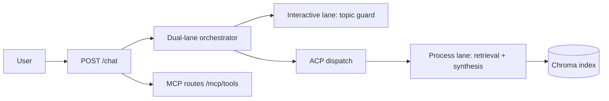

# zooplus Assistant (PoC)

Async FastAPI chat API for pet-product questions using RAG over the provided catalog, with strict `site_id` isolation and topic guardrails.

---

## Start here (local install)

**New to the repo?** Use the wizard — it installs Python deps, builds the index, and optionally logs you into OpenCode:

```powershell
git checkout releases
.\scripts\setup_wizard.ps1
.\scripts\run_dev.ps1
```

| URL | Purpose |
|-----|---------|
| **http://127.0.0.1:8090/ui/** | Chat UI (default dev port) |
| **http://127.0.0.1:8090/docs** | Swagger — FR1 async `/chat` |
| **http://127.0.0.1:8090/health** | Liveness check |

**Step-by-step (all paths):** [`docs/QUICKSTART.md`](docs/QUICKSTART.md)  
**Developer branches + filters:** [`docs/GIT_WORKFLOW.md`](docs/GIT_WORKFLOW.md)

| Mode | OpenCode | Use when |
|------|----------|----------|
| **Template** (wizard option 1) | Not needed | Fastest setup, CI, acceptance tests |
| **OpenCode** (wizard option 2) | `opencode auth login` | Interview demo with free LLMs |

---

## Architecture



- **Interactive lane** decides `ALLOW`/`DECLINE` quickly via topic guard.
- **Process lane** runs **hybrid retrieval** (vector candidates + BM25 + rating/sales/stock rerank).
- Override: `ZOOPLUS_RETRIEVAL_MODE=vector` for vector-only A/B.
- **MCP tools** expose `topic_check` and `catalog_search` on the same FastAPI host.
- **Constraints** in `src/guardian/constraints.yaml` enforce recommendation caps and grounding.

## Core API

### `POST /chat/stream`

Same body as `/chat`. Returns **NDJSON** (`application/x-ndjson`) events:

| Event type | When |
|------------|------|
| `topic` | Fast lane decision (`ALLOW` / `DECLINE`) |
| `products` | Retrieved catalog hits (in-scope only) |
| `answer_chunk` | Streaming answer fragments |
| `done` | Final `answer` + `retrieved_products` |

### `POST /chat`

Request:

```json
{
  "site_id": 3,
  "query": "best dry food for puppy"
}
```

Response:

```json
{
  "answer": "I found these options in your shop catalog: ...",
  "retrieved_products": []
}
```

Behavior:
- Off-topic (`weather`, `time`, `datetime`, `news`, general-knowledge patterns) returns polite decline with empty `retrieved_products`.
- In-scope requests return products retrieved only from the same `site_id`.

## Manual setup (without wizard)

**Python 3.11** required — see [`docs/DEPENDENCIES.md`](docs/DEPENDENCIES.md).

```powershell
py -3.11 -m venv .venv
.\.venv\Scripts\Activate.ps1
pip install -e ".[rag,dev]"
copy .env.example .env
py -3.11 -m cli ingest
.\scripts\run_dev.ps1
```

**Docker:**

```bash
docker compose up --build -d
python scripts/deploy_smoke.py http://127.0.0.1:8080
```

## Verify

```powershell
.\scripts\smoke_minimal.ps1              # ~2 min, no OpenCode
py -3.11 scripts/run_quality_gates.py    # full gates
.\scripts\run_release_verify.ps1         # release line (incl. OpenCode social)
```

## OpenCode (optional — wizard configures this)

Free-tier models via your OpenCode account. Credentials live in **gitignored** `.opencode/data/auth.json`.

```powershell
.\scripts\setup_opencode_local.ps1   # copy or prompt login
opencode models                    # list free models
```

Never commit: `.env`, `auth.json`, `.opencode/data/`.

If OpenCode fails, the API **falls back to template synthesis**.

## Trade-offs

- **Local Chroma over hosted vector DB:** fastest PoC setup, not production-scale.
- **Rule-first topic guard:** deterministic and low latency, less nuanced than full classifier models.
- **Template synthesis:** reproducible without keys; wizard option 2 enables OpenCode for richer replies.
- **Max 4 recommendations:** clear UX and constraint-compliant, may omit longer-tail candidates.

## Roadmap

1. Harden constraints + prompt-injection defense (versioned policy packs).
2. Structured intent filters (`pet_type`, price band, category) for better retrieval.
3. LLM provider abstraction (OpenCode local · HTTP API in cloud).
4. MCP server for external agents; extend internal ACP envelopes.
5. Optional promo slots during long `/chat/stream` turns (commerce UX).
6. Managed vector DB + observability (latency, decline reasons, hit rates).

Summary for interview slides: [`docs/deliverables/v0.1/FUTURE_IMPROVEMENTS.md`](docs/deliverables/v0.1/FUTURE_IMPROVEMENTS.md).

## Release status

| Branch / tag | Meaning |
|--------------|---------|
| **`releases`** | Interview / take-home line — use wizard here |
| **`main`** | Full dev history, matrix tooling |

## Interview / submission

- Checklist: [`docs/deliverables/v0.1/CODING_TASK_CHECKLIST.md`](docs/deliverables/v0.1/CODING_TASK_CHECKLIST.md)
- **Presentation (pro):** [`docs/deliverables/v0.1/zooplus-assistant-interview-15min-pro.pptx`](docs/deliverables/v0.1/zooplus-assistant-interview-15min-pro.pptx)
- Speaker script: [`docs/deliverables/v0.1/PRESENTATION_15MIN.md`](docs/deliverables/v0.1/PRESENTATION_15MIN.md)

## Docs

| Doc | Purpose |
|-----|---------|
| [`docs/QUICKSTART.md`](docs/QUICKSTART.md) | **Install step-by-step** |
| [`docs/GIT_WORKFLOW.md`](docs/GIT_WORKFLOW.md) | feature → filters → release |
| [`docs/RUNBOOK.md`](docs/RUNBOOK.md) | Operations |
| [`docs/RELEASE_v0.1.md`](docs/RELEASE_v0.1.md) | Tag verify |
