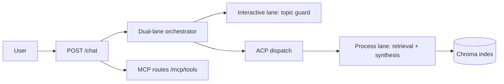

# zooplus Assistant (PoC)

Async FastAPI chat API for pet-product questions using RAG over the provided catalog, with strict `site_id` isolation and topic guardrails.

## Architecture



- **Interactive lane** decides `ALLOW`/`DECLINE` quickly via topic guard.
- **Process lane** runs retrieval and grounded response synthesis (max 4 products).
- **MCP tools** expose `topic_check` and `catalog_search` on the same FastAPI host.
- **Constraints** in `src/guardian/constraints.yaml` enforce recommendation caps and grounding.

## Core API

### `POST /chat`

Request:

```json
{
  "site_id": 3,
  "query": "best dry food for puppy"
}
```

Response:

```json
{
  "answer": "I found these options in your shop catalog: ...",
  "retrieved_products": []
}
```

Behavior:
- Off-topic (`weather`, `time`, `datetime`, `news`, general-knowledge patterns) returns polite decline with empty `retrieved_products`.
- In-scope requests return products retrieved only from the same `site_id`.

## Setup

```bash
pip install -e ".[rag,dev]"
python -m cli ingest
uvicorn src.api.app:app --reload --port 8080
```

Useful checks:

```bash
python scripts/run_quality_gates.py
```

## Trade-offs

- **Local Chroma over hosted vector DB:** fastest PoC setup, not production-scale.
- **Rule-first topic guard:** deterministic and low latency, less nuanced than full classifier models.
- **Template synthesis without external LLM keys:** reproducible and safe for take-home, less natural language richness.
- **Max 4 recommendations:** clear UX and constraint-compliant, may omit longer-tail candidates.

## Roadmap

1. Add richer reranking (brand/stock/price-aware) with calibrated relevance scores.
2. Add streaming endpoint (`/chat/stream`) with early interactive acknowledgements.
3. Add observability (latency buckets per lane, decline reasons, retrieval hit rates).
4. Add hybrid search (vector + lexical fallback) for SKU/name exact-match robustness.
5. Add production deployment profile (containerization + managed vector store).

## Release status

| Branch / tag | Meaning |
|--------------|---------|
| `main` @ **v1.0.0** | MVP — brief-complete, tested (`POST /chat`, RAG, guardrails) |
| `dev` | Integration for **v1.1.0+** (see [`docs/RELEASE_PLAN.md`](docs/RELEASE_PLAN.md)) |

## Docs and trace

- Release plan: [`docs/RELEASE_PLAN.md`](docs/RELEASE_PLAN.md)
- Main docs index: [`docs/README.md`](docs/README.md)
- Proposal: [`docs/plans/PROPOSAL.md`](docs/plans/PROPOSAL.md)
- Progress dashboard: [`docs/trace/PROGRESS.md`](docs/trace/PROGRESS.md)
- Step logs T0-T6: [`docs/trace/README.md`](docs/trace/README.md)
