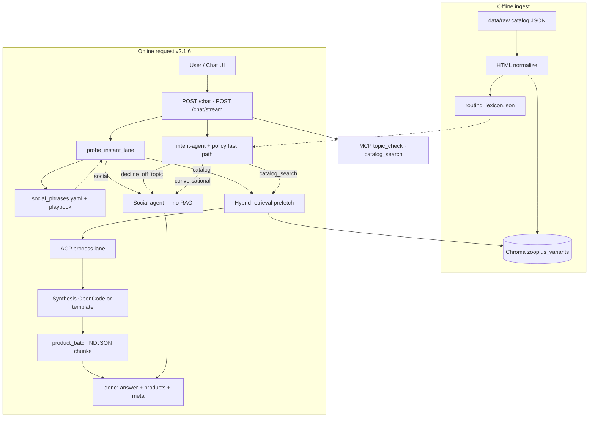

# zooplus Assistant (PoC)

Async FastAPI chat API for pet-product questions: conductor-first agentic routing, hybrid RAG over the provided catalog, strict `site_id` isolation, and default-deny guardrails.

---

## Start here (local install)

**New to the repo?** Use the wizard — it installs Python deps, builds the index, and optionally logs you into OpenCode:

```powershell
git checkout releases
.\scripts\setup_wizard.ps1
.\scripts\run_dev.ps1
```

| URL | Purpose |
|-----|---------|
| **http://127.0.0.1:8090/ui/** | Chat UI (default dev port) |
| **http://127.0.0.1:8090/docs** | Swagger — FR1 async `/chat` |
| **http://127.0.0.1:8090/health** | Liveness check |

**Step-by-step (all paths):** [`docs/QUICKSTART.md`](docs/QUICKSTART.md)  
**Developer branches + filters:** [`docs/GIT_WORKFLOW.md`](docs/GIT_WORKFLOW.md)

| Mode | OpenCode | Use when |
|------|----------|----------|
| **Template** (wizard option 1) | Not needed | Fastest setup, CI, acceptance tests |
| **OpenCode** (wizard option 2) | `opencode auth login` | Interview demo with free LLMs |

---

## Architecture



**Request flow (v2.1.6):**

1. **Fast probe** (`probe_instant_lane`) uses the **phrase index** + playbook to route obvious social/help turns before catalog progress chunks appear.
2. **Intent** (`zooplus-intent-agent` + policy probes) classifies into `conversational`, `decline_off_topic`, or `catalog_search`. Conductor intent is **opt-in** (`ZOOPLUS_CONDUCTOR_INTENT=0` default) for lower latency.
3. **Social lane** — greetings, pure help (`can you help me`), thanks — via `zooplus-social-agent`; no RAG; first-turn greetings stay natural; mid-session dedupe strips repeated intros. **Shopping + help** (e.g. “light food for my dogs… can you help?”) routes to **catalog**, not help FAQ.
4. **Catalog lane** — hybrid retrieval, optional EUR price filter, **`resolve_recommendation_count()`** (default **4**, shopper can ask up to **20**), grounded synthesis.
5. **Stream** (`/chat/stream`) — `typing` → `chunk*` → `product_batch*` (cards in batches of 4) → `done`.
6. **Playbook** (`conductor_playbook.md`) auto-learns species, help phrases, and forbidden repeats — invisible to shoppers.
7. Blocking work runs in `asyncio.to_thread` (FR1). Optional Redis mirrors TTL caches.

| Knob | Purpose |
|------|---------|
| `ZOOPLUS_RETRIEVAL_MODE=vector` | Vector-only retrieval for A/B |
| `ZOOPLUS_SYNTHESIS_MODE=template` | Deterministic answers without OpenCode (CI) |
| `ZOOPLUS_CONDUCTOR_INTENT=1` | Opt-in conductor intent before RAG |
| `ZOOPLUS_STREAM_MODE=conductor` | Conductor progress chunks (default) |

- **Constraints** in `src/guardian/constraints.yaml`: default-deny scope, **4 default / 20 max** recommendations, `must_ground_in_retrieval`.
- **MCP tools** on the same host: `topic_check`, `catalog_search`.
- **Deep dive:** [`docs/02-rag-architecture.md`](docs/02-rag-architecture.md)

## Core API

The Chat UI uses **`POST /chat/stream`**; Swagger and integrations can use **`POST /chat`** (same contract, JSON response).

### Request

```json
{
  "site_id": 3,
  "query": "best dry food for puppy",
  "preferred_model": null
}
```

`preferred_model` is an optional OpenCode model override from the UI debug selector.

### `POST /chat` response

```json
{
  "answer": "I found these options in your shop catalog: ...",
  "retrieved_products": [],
  "meta": {
    "lane": "catalog_search",
    "intent_source": "conductor",
    "llm_agent": "zooplus-synthesis",
    "llm_model": "opencode/deepseek-v4-flash-free"
  }
}
```

`meta` is populated when OpenCode runs; template-only profiles may omit some fields.

### `POST /chat/stream` (NDJSON)

Returns `application/x-ndjson` — one JSON object per line:

| Event type | When |
|------------|------|
| `typing` | Typing indicator between chunks |
| `chunk` / `status` | Progress bubbles while intent/RAG runs (conductor or timed mode) |
| `topic` | Lane decision metadata |
| `product_batch` | Catalog hits in batches of 4 when count > 4 (v2.1.6) |
| `products` | All catalog hits at once (≤4 picks path) |
| `done` | Final `answer`, `retrieved_products`, and `meta` |

The UI paces **chunk** messages and reveals **product_batch** cards gradually before the final answer.

### Behavior

| Lane | RAG | `retrieved_products` |
|------|-----|----------------------|
| `conversational` | No | `[]` — greetings, thanks, help |
| `decline_off_topic` | No | `[]` — weather, news, non-pet, competitors |
| `catalog_search` | Yes | Default 4 products; up to 20 if shopper asks (same `site_id`) |

Multilingual shopper replies; static UI copy stays English. Replies are **professional and concise** — no internal strategy or tech exposition to shoppers (`CUSTOMER_VOICE` in agent prompts). Reply language: **detected from the shopper message** when clear; if ambiguous, falls back to **`Accept-Language`** (then shop locale). Pick a shop (**Germany**, **UK**, or **Spain**) before sending.

## Manual setup (without wizard)

**Python 3.11** required — see [`docs/DEPENDENCIES.md`](docs/DEPENDENCIES.md).

```powershell
py -3.11 -m venv .venv
.\.venv\Scripts\Activate.ps1
pip install -e ".[rag,dev]"
copy .env.example .env
py -3.11 -m cli ingest
.\scripts\run_dev.ps1
```

**Docker:**

```bash
docker compose up --build -d
python scripts/deploy_smoke.py http://127.0.0.1:8080
```

## Verify

```powershell
.\scripts\smoke_minimal.ps1              # ~2 min, no OpenCode
py -3.11 scripts/run_quality_gates.py    # full gates
.\scripts\run_release_verify.ps1         # release line (incl. OpenCode social)
```

## OpenCode (optional — wizard configures this)

Free-tier models via your OpenCode account — **one model per agent** (conductor, social, intent, synthesis) in `.opencode/config-cli/opencode.json`. Credentials live in **gitignored** `.opencode/data/auth.json`.

```powershell
.\scripts\setup_opencode_local.ps1   # copy or prompt login
opencode models                    # list free models
```

Never commit: `.env`, `auth.json`, `.opencode/data/`.

If OpenCode fails or times out, the API **falls back to template synthesis** or topic-based intent fallback.

## Trade-offs

- **Local Chroma over hosted vector DB:** fastest PoC setup, not production-scale (`ZOOPLUS_VECTOR_BACKEND=managed` is a placeholder).
- **Conductor-first agentic routing:** multilingual and fast on social turns; adds OpenCode latency on catalog path vs pure rules.
- **Hybrid retrieval on a small catalog:** BM25 over Chroma candidates works at 300 rows; at millions of SKUs you would add metadata-first filters and a dedicated sparse index (see [`FUTURE_IMPROVEMENTS.md`](docs/deliverables/v0.1/FUTURE_IMPROVEMENTS.md)).
- **Template synthesis fallback:** reproducible without keys; wizard option 2 enables per-agent OpenCode models for richer replies.
- **Default 4 / max 20 recommendations:** clear UX by default; shopper can request more; `product_batch` stream reveals cards in chunks.
- **In-process TTL cache (optional Redis):** cuts repeat latency; not shared until Redis is enabled.

## Roadmap

1. Harden constraints + prompt-injection defense (versioned policy packs).
2. Structured intent filters (`pet_type`, price band, category) for better retrieval.
3. LLM provider abstraction (OpenCode local · HTTP API in cloud).
4. MCP server for external agents; extend internal ACP envelopes.
5. Optional promo slots during long `/chat/stream` turns (commerce UX).
6. Managed vector DB + observability (latency, decline reasons, hit rates).
7. **Multi-shop retrieval** — optional all-shops or `site_ids[]` in UI/API; Chroma `$in` filter, merge/dedup, locale labels on cards (see [`FUTURE_IMPROVEMENTS.md`](docs/deliverables/v0.1/FUTURE_IMPROVEMENTS.md) § item #10).

Summary for interview slides: [`docs/deliverables/v0.1/FUTURE_IMPROVEMENTS.md`](docs/deliverables/v0.1/FUTURE_IMPROVEMENTS.md).

## Release status

| Branch / tag | Meaning |
|--------------|---------|
| **`releases`** | Interview / take-home line — use wizard here |
| **`main`** | Full dev history, matrix tooling, QA, speaker script, work history |

## Interview / submission

- Checklist: [`docs/deliverables/v0.1/CODING_TASK_CHECKLIST.md`](docs/deliverables/v0.1/CODING_TASK_CHECKLIST.md)
- **Presentation (pro):** [`docs/deliverables/v0.1/zooplus-assistant-interview-15min-pro.pptx`](docs/deliverables/v0.1/zooplus-assistant-interview-15min-pro.pptx)
- **Q&A prep (main only):** [`docs/deliverables/v0.1/QA_FOR_POC.md`](docs/deliverables/v0.1/QA_FOR_POC.md)
- **Speaker script (main only):** [`docs/deliverables/v0.1/PRESENTATION_15MIN.md`](docs/deliverables/v0.1/PRESENTATION_15MIN.md)
- **Work history book (main only):** [`docs/HISTORIA_DEL_PROYECTO.md`](docs/HISTORIA_DEL_PROYECTO.md) — regenerate with `py -3 scripts/build_work_history.py`

## Docs

| Doc | Purpose |
|-----|---------|
| [`docs/QUICKSTART.md`](docs/QUICKSTART.md) | **Install step-by-step** |
| [`docs/02-rag-architecture.md`](docs/02-rag-architecture.md) | Ingest, hybrid retrieval, metadata |
| [`docs/GIT_WORKFLOW.md`](docs/GIT_WORKFLOW.md) | feature → filters → release |
| [`docs/RUNBOOK.md`](docs/RUNBOOK.md) | Operations |
| [`docs/RELEASE_v0.1.md`](docs/RELEASE_v0.1.md) | Tag verify |
| [`docs/deliverables/v0.1/README.md`](docs/deliverables/v0.1/README.md) | Interview deliverable pack |
| [`docs/deliverables/v0.1/CHANGELOG_v2.1.4_to_v2.1.6.md`](docs/deliverables/v0.1/CHANGELOG_v2.1.4_to_v2.1.6.md) | Current releases line (v2.1.6) |
