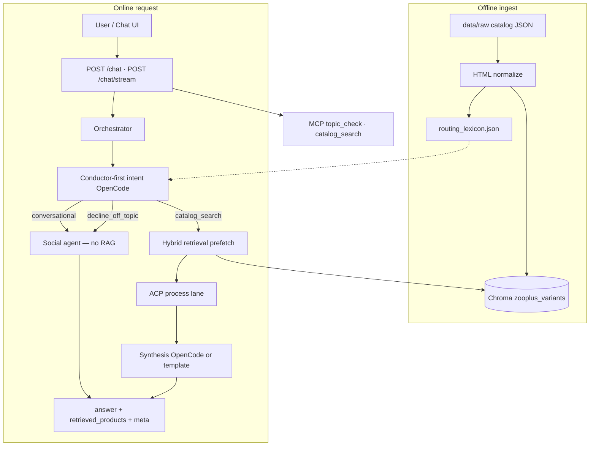

# zooplus Assistant (PoC)

Async FastAPI chat API for pet-product questions: conductor-first agentic routing, hybrid RAG over the provided catalog, strict `site_id` isolation, and default-deny guardrails.

---

## Start here (local install)

**New to the repo?** Use the wizard — it installs Python deps, builds the index, and optionally logs you into OpenCode:

```powershell
git checkout releases
.\scripts\setup_wizard.ps1
.\scripts\run_dev.ps1
```

| URL | Purpose |
|-----|---------|
| **http://127.0.0.1:8090/ui/** | Chat UI (default dev port) |
| **http://127.0.0.1:8090/docs** | Swagger — FR1 async `/chat` |
| **http://127.0.0.1:8090/health** | Liveness check |

**Step-by-step (all paths):** [`docs/QUICKSTART.md`](docs/QUICKSTART.md)  
**Developer branches + filters:** [`docs/GIT_WORKFLOW.md`](docs/GIT_WORKFLOW.md)

| Mode | OpenCode | Use when |
|------|----------|----------|
| **Template** (wizard option 1) | Not needed | Fastest setup, CI, acceptance tests |
| **OpenCode** (wizard option 2) | `opencode auth login` | Interview demo with free LLMs |

---

## Architecture



**Request flow (v0.1.3):**

1. **Conductor-first intent** (`zooplus-conductor`) classifies the turn into `conversational`, `decline_off_topic`, or `catalog_search` **before** Chroma is queried on greetings and off-topic traffic.
2. **Social lane** handles greetings and declines via `zooplus-social-agent` — `retrieved_products` stays empty; the index is not searched.
3. **Catalog lane** prefetches **hybrid retrieval** (Chroma vector candidates + in-memory BM25 + business-signal fusion), optional EUR price-band filter, then **grounded synthesis** (max 4 products).
4. **Catalog lexicon** built at ingest (`routing_lexicon.json`) feeds agent prompts — no hardcoded dog/cat word lists.
5. **Blocking work** (Chroma, OpenCode) runs in `asyncio.to_thread` inside async FastAPI handlers (FR1).
6. **Optional Redis** (`ZOOPLUS_CACHE_BACKEND=redis`) mirrors TTL caches and lexicon for multi-replica setups.

| Knob | Purpose |
|------|---------|
| `ZOOPLUS_RETRIEVAL_MODE=vector` | Vector-only retrieval for A/B |
| `ZOOPLUS_SYNTHESIS_MODE=template` | Deterministic answers without OpenCode (CI) |
| `ZOOPLUS_CONDUCTOR_INTENT=1` | Conductor classifies before RAG (default on `releases`) |

- **Constraints** in `src/guardian/constraints.yaml`: default-deny scope, max 4 recommendations, `must_ground_in_retrieval`.
- **MCP tools** on the same host: `topic_check`, `catalog_search`.
- **Deep dive:** [`docs/02-rag-architecture.md`](docs/02-rag-architecture.md)

## Core API

The Chat UI uses **`POST /chat/stream`**; Swagger and integrations can use **`POST /chat`** (same contract, JSON response).

### Request

```json
{
  "site_id": 3,
  "query": "best dry food for puppy",
  "preferred_model": null
}
```

`preferred_model` is an optional OpenCode model override from the UI debug selector.

### `POST /chat` response

```json
{
  "answer": "I found these options in your shop catalog: ...",
  "retrieved_products": [],
  "meta": {
    "lane": "catalog_search",
    "intent_source": "conductor",
    "llm_agent": "zooplus-synthesis",
    "llm_model": "opencode/deepseek-v4-flash-free"
  }
}
```

`meta` is populated when OpenCode runs; template-only profiles may omit some fields.

### `POST /chat/stream` (NDJSON)

Returns `application/x-ndjson` — one JSON object per line:

| Event type | When |
|------------|------|
| `status` | Backend-driven phases (`reading`, `understood`, `searching`, …) with optional `shopper_status` from the conductor |
| `topic` | Lane decision (`ALLOW` / `DECLINE` + `reason_code`) |
| `products` | Catalog hits (catalog lane only) |
| `done` | Final `answer`, `retrieved_products`, and `meta` |

The UI shows a **single transient status bubble** that updates from `status` events and clears on `done`.

### Behavior

| Lane | RAG | `retrieved_products` |
|------|-----|----------------------|
| `conversational` | No | `[]` — greetings, thanks, help |
| `decline_off_topic` | No | `[]` — weather, news, non-pet, competitors |
| `catalog_search` | Yes | Up to 4 products from the same `site_id` only |

Multilingual shopper replies; static UI copy stays English. Pick a shop (**Germany**, **UK**, or **Spain**) before sending (UI blocks Send until config loads).

## Manual setup (without wizard)

**Python 3.11** required — see [`docs/DEPENDENCIES.md`](docs/DEPENDENCIES.md).

```powershell
py -3.11 -m venv .venv
.\.venv\Scripts\Activate.ps1
pip install -e ".[rag,dev]"
copy .env.example .env
py -3.11 -m cli ingest
.\scripts\run_dev.ps1
```

**Docker:**

```bash
docker compose up --build -d
python scripts/deploy_smoke.py http://127.0.0.1:8080
```

## Verify

```powershell
.\scripts\smoke_minimal.ps1              # ~2 min, no OpenCode
py -3.11 scripts/run_quality_gates.py    # full gates
.\scripts\run_release_verify.ps1         # release line (incl. OpenCode social)
```

## OpenCode (optional — wizard configures this)

Free-tier models via your OpenCode account — **one model per agent** (conductor, social, intent, synthesis) in `.opencode/config-cli/opencode.json`. Credentials live in **gitignored** `.opencode/data/auth.json`.

```powershell
.\scripts\setup_opencode_local.ps1   # copy or prompt login
opencode models                    # list free models
```

Never commit: `.env`, `auth.json`, `.opencode/data/`.

If OpenCode fails or times out, the API **falls back to template synthesis** or topic-based intent fallback.

## Trade-offs

- **Local Chroma over hosted vector DB:** fastest PoC setup, not production-scale (`ZOOPLUS_VECTOR_BACKEND=managed` is a placeholder).
- **Conductor-first agentic routing:** multilingual and fast on social turns; adds OpenCode latency on catalog path vs pure rules.
- **Hybrid retrieval on a small catalog:** BM25 over Chroma candidates works at 300 rows; at millions of SKUs you would add metadata-first filters and a dedicated sparse index (see [`QA_FOR_POC.md`](docs/deliverables/v0.1/QA_FOR_POC.md)).
- **Template synthesis fallback:** reproducible without keys; wizard option 2 enables per-agent OpenCode models for richer replies.
- **Max 4 recommendations:** clear UX and constraint-compliant, may omit longer-tail candidates.
- **In-process TTL cache (optional Redis):** cuts repeat latency; not shared until Redis is enabled.

## Roadmap

1. Harden constraints + prompt-injection defense (versioned policy packs).
2. Structured intent filters (`pet_type`, price band, category) for better retrieval.
3. LLM provider abstraction (OpenCode local · HTTP API in cloud).
4. MCP server for external agents; extend internal ACP envelopes.
5. Optional promo slots during long `/chat/stream` turns (commerce UX).
6. Managed vector DB + observability (latency, decline reasons, hit rates).

Summary for interview slides: [`docs/deliverables/v0.1/FUTURE_IMPROVEMENTS.md`](docs/deliverables/v0.1/FUTURE_IMPROVEMENTS.md).

## Release status

| Branch / tag | Meaning |
|--------------|---------|
| **`releases`** | Interview / take-home line — use wizard here |
| **`main`** | Full dev history, matrix tooling |

## Interview / submission

- Checklist: [`docs/deliverables/v0.1/CODING_TASK_CHECKLIST.md`](docs/deliverables/v0.1/CODING_TASK_CHECKLIST.md)
- **Q&A prep:** [`docs/deliverables/v0.1/QA_FOR_POC.md`](docs/deliverables/v0.1/QA_FOR_POC.md) — likely questions, answers, scale-out strategy
- **Presentation (pro):** [`docs/deliverables/v0.1/zooplus-assistant-interview-15min-pro.pptx`](docs/deliverables/v0.1/zooplus-assistant-interview-15min-pro.pptx)
- Speaker script: [`docs/deliverables/v0.1/PRESENTATION_15MIN.md`](docs/deliverables/v0.1/PRESENTATION_15MIN.md)

## Docs

| Doc | Purpose |
|-----|---------|
| [`docs/QUICKSTART.md`](docs/QUICKSTART.md) | **Install step-by-step** |
| [`docs/02-rag-architecture.md`](docs/02-rag-architecture.md) | Ingest, hybrid retrieval, metadata |
| [`docs/GIT_WORKFLOW.md`](docs/GIT_WORKFLOW.md) | feature → filters → release |
| [`docs/RUNBOOK.md`](docs/RUNBOOK.md) | Operations |
| [`docs/RELEASE_v0.1.md`](docs/RELEASE_v0.1.md) | Tag verify |
| [`docs/deliverables/v0.1/README.md`](docs/deliverables/v0.1/README.md) | Interview deliverable pack |
| [`docs/deliverables/v0.1/QA_FOR_POC.md`](docs/deliverables/v0.1/QA_FOR_POC.md) | Interview Q&A and scale-out talking points |
