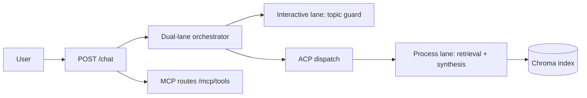

# zooplus Assistant (PoC)

Async FastAPI chat API for pet-product questions using RAG over the provided catalog, with strict `site_id` isolation and topic guardrails.

## Architecture



- **Interactive lane** decides `ALLOW`/`DECLINE` quickly via topic guard.
- **Process lane** runs **hybrid retrieval** (vector candidates + BM25 + rating/sales/stock rerank).
- Override: `ZOOPLUS_RETRIEVAL_MODE=vector` for vector-only A/B.
- **MCP tools** expose `topic_check` and `catalog_search` on the same FastAPI host.
- **Constraints** in `src/guardian/constraints.yaml` enforce recommendation caps and grounding.

## Core API

### `POST /chat/stream`

Same body as `/chat`. Returns **NDJSON** (`application/x-ndjson`) events:

| Event type | When |
|------------|------|
| `topic` | Fast lane decision (`ALLOW` / `DECLINE`) |
| `products` | Retrieved catalog hits (in-scope only) |
| `answer_chunk` | Streaming answer fragments |
| `done` | Final `answer` + `retrieved_products` |

### `POST /chat`

Request:

```json
{
  "site_id": 3,
  "query": "best dry food for puppy"
}
```

Response:

```json
{
  "answer": "I found these options in your shop catalog: ...",
  "retrieved_products": []
}
```

Behavior:
- Off-topic (`weather`, `time`, `datetime`, `news`, general-knowledge patterns) returns polite decline with empty `retrieved_products`.
- In-scope requests return products retrieved only from the same `site_id`.

## Setup

**Python 3.11** (matches CI and Docker — see [`docs/DEPENDENCIES.md`](docs/DEPENDENCIES.md)):

```bash
py -3.11 -m venv .venv
.venv\Scripts\activate   # Windows
pip install -e ".[rag,dev]"
python -m cli ingest
uvicorn src.api.app:app --reload --port 8080
```

**Chat UI:** open [http://127.0.0.1:8080/ui/](http://127.0.0.1:8080/ui/) after the server starts. Details: [`docs/CHAT_UI.md`](docs/CHAT_UI.md).

**Docker (v2):**

```bash
docker compose up --build -d
python scripts/deploy_smoke.py http://127.0.0.1:8080
```

Runbook: [`docs/RUNBOOK.md`](docs/RUNBOOK.md)  
**Demo completa:** [`docs/DEMO.md`](docs/DEMO.md) — `python scripts/demo_all.py`

Useful checks:

```bash
python scripts/run_quality_gates.py
python -m cli evaluate
py -3 scripts/topic_guard_load_test.py   # G1 p95 budget check
```

## OpenCode LLM (optional, user-configured)

By default answers use **template synthesis** (no API keys). To use **free-tier models from your OpenCode account**:

1. Copy [`.env.example`](.env.example) → `.env` (`.env` is gitignored).
2. Run `opencode auth login` — credentials go to `~/.local/share/opencode/auth.json`, **never commit this file**.
3. Optional project-local profile: set `ZOOPLUS_OPENCODE_DATA_DIR=.opencode/data` and `OPENCODE_DATA_DIR=.opencode/data` before login; that directory is gitignored.
4. Set `ZOOPLUS_SYNTHESIS_MODE=opencode` and `ZOOPLUS_OPENCODE_MODEL` (see `opencode models`).

**Never commit:** `auth.json`, `.opencode/auth.json`, `.opencode/data/auth.json`, or `.env`. They are listed in [`.gitignore`](.gitignore).

If OpenCode is missing or fails, the API **falls back** to template synthesis automatically.

## Trade-offs

- **Local Chroma over hosted vector DB:** fastest PoC setup, not production-scale.
- **Rule-first topic guard:** deterministic and low latency, less nuanced than full classifier models.
- **Template synthesis (default):** reproducible without keys; set `ZOOPLUS_SYNTHESIS_MODE=opencode` for richer LLM replies via your OpenCode login.
- **Max 4 recommendations:** clear UX and constraint-compliant, may omit longer-tail candidates.

## Roadmap

1. Add richer reranking (brand/stock/price-aware) with calibrated relevance scores.
2. Add streaming endpoint (`/chat/stream`) with early interactive acknowledgements.
3. Add observability (latency buckets per lane, decline reasons, retrieval hit rates).
4. Add hybrid search (vector + lexical fallback) for SKU/name exact-match robustness.
5. Add production deployment profile (containerization + managed vector store).

## Release status

| Branch / tag | Meaning |
|--------------|---------|
| `main` @ **v2.1.0** | Production profile + Python 3.11 / pinned deps |
| `dev` | Post-v2 enhancements (see [`docs/RELEASE_PLAN.md`](docs/RELEASE_PLAN.md)) |

## Docs and trace

- Release plan: [`docs/RELEASE_PLAN.md`](docs/RELEASE_PLAN.md)
- Main docs index: [`docs/README.md`](docs/README.md)
- Proposal: [`docs/plans/PROPOSAL.md`](docs/plans/PROPOSAL.md)
- Progress dashboard: [`docs/trace/PROGRESS.md`](docs/trace/PROGRESS.md)
- Step logs T0-T6: [`docs/trace/README.md`](docs/trace/README.md)
