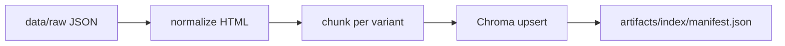

# RAG architecture

**Status:** COMPLETE (T2)  
**Branch:** `feature/T2-rag-index`  
**EDA input:** [`01-eda-report.md`](01-eda-report.md)

---

## 1. Design summary

| Decision | Choice | Rationale |
|----------|--------|-----------|
| Chunk unit | **One document per row** (unique `article_id`) | 300 rows; `variant_id` not globally unique |
| Chroma ID | `{site_id}:{locale}:{article_id}:{variant_id}` | Duplicate rows get `:dupN` suffix on ingest |
| Raw data | `data/raw/product_catalog_dataset.json` | Never edited in place |
| HTML handling | `src/rag/normalize.py` | EDA showed ~18–22% tag density |
| Vector store | **Chroma** persistent (`artifacts/index/chroma`) | Zero external infra for PoC |
| Embeddings | Chroma default (local) | No API key required for ingest smoke tests |
| Retrieval | **Hybrid filter-then-score** (v1.2) | Chroma candidates + BM25 + business rerank |
| Retrieval (legacy) | `ZOOPLUS_RETRIEVAL_MODE=vector` | Vector-only path for A/B tests |

---

## 2. Pipeline stages



| Stage | Module | CLI |
|-------|--------|-----|
| Normalize + chunk | `src/rag/chunking.py` | — |
| Index build | `src/rag/pipeline.py` | `python -m cli ingest` |
| Query | `src/rag/retrieve.py` | hybrid default; `hybrid.py`, `lexical.py`, `rerank.py` |

---

## 3. Metadata stored per vector

| Field | Use |
|-------|-----|
| `site_id` | **Hard filter** on every query |
| `article_id`, `product_id`, `variant_id` | Response `retrieved_products` |
| `pet_type`, `brands`, `product_name` | Logic agent + display |
| `price`, `stock_units` | Ranking / availability |
| `has_ingredients` | Route nutrition queries (T5) |

---

## 4. Idempotent ingest

`cli ingest` deletes and recreates collection `zooplus_variants` so re-runs are safe during PoC development.

---

## 5. Verification

```bash
pip install -e ".[rag,dev]"
python -m cli ingest
pytest tests/test_rag_index.py -q
```

Expected: 300 records ingested; retrieval returns only matching `site_id`.

---

## Trace

- Step log: [`trace/T2-rag-index.md`](trace/T2-rag-index.md)
- Skills: `skill_04`, `skill_05`, `skill_06` in `src/skills/registry.py`
