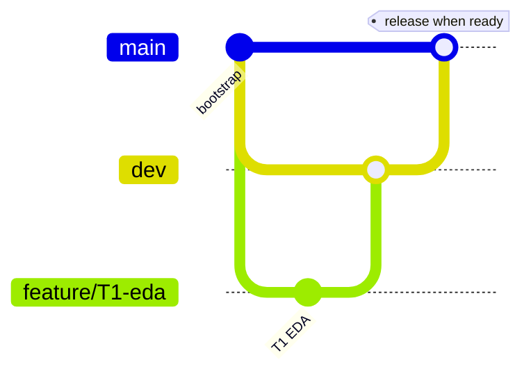

# Git workflow

**Remote:** [https://github.com/peluzzza/PoCAssistantZooplus.git](https://github.com/peluzzza/PoCAssistantZooplus.git)

## Branches

| Branch | Purpose |
|--------|---------|
| `main` | Stable, demo-ready snapshots only |
| `dev` | Integration branch — merge all `feature/*` here first |
| `feature/<name>` | Short-lived work (T1, T2, …) |

## Flow



1. Branch `feature/<step>` from `dev`.
2. Implement + update `docs/trace/`.
3. Merge `feature/*` → `dev` (PR or local merge).
4. When a milestone is ready to show: merge `dev` → `main` (or cherry-pick).

## Commands (from repo root)

```bash
git fetch origin
git checkout dev
git pull origin dev
git checkout -b feature/T1-eda
# ... work ...
git push -u origin feature/T1-eda
git checkout dev && git merge feature/T1-eda
git push origin dev
```
