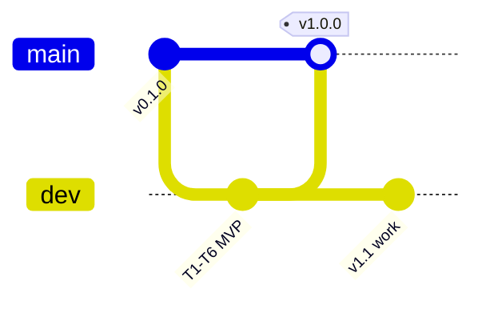

# Git workflow

**Remote:** [https://github.com/peluzzza/PoCAssistantZooplus.git](https://github.com/peluzzza/PoCAssistantZooplus.git)

## Release policy

Merges to `main` follow [`RELEASE_PLAN.md`](RELEASE_PLAN.md) — only when milestone exit criteria pass.

| Tag on `main` | When |
|---------------|------|
| `v0.1.0` | P0 bootstrap only |
| `v1.0.0` | MVP — B1–B9, 19 tests, CI green |
| `v1.1.0+` | Planned (streaming, golden queries, …) |

## Current state

| Branch | Role |
|--------|------|
| `main` | Stable tagged releases |
| `dev` | Integration — all `feature/*` merge here first |
| `feature/<name>` | Short-lived steps |

## Pre-merge quality (required)

```bash
pip install -e ".[rag,dev]"
python scripts/run_quality_gates.py
```

Details: [`QUALITY.md`](QUALITY.md).

## Flow



1. `git checkout dev && git pull`
2. `git checkout -b feature/<step>` → work → merge to `dev` → push
3. When milestone ready: merge `dev` → `main`, tag `vX.Y.Z`, push (see `RELEASE_PLAN.md`)

## Commands

```bash
git fetch origin
git checkout dev && git pull origin dev
git checkout -b feature/my-step
# ... work, quality gates ...
git push -u origin feature/my-step
git checkout dev && git merge feature/my-step && git push origin dev
```

Release to main:

```bash
python scripts/run_quality_gates.py
git checkout main && git pull origin main
git merge dev -m "release: vX.Y.Z — title"
git tag -a vX.Y.Z -m "vX.Y.Z — title"
git push origin main && git push origin vX.Y.Z
```
