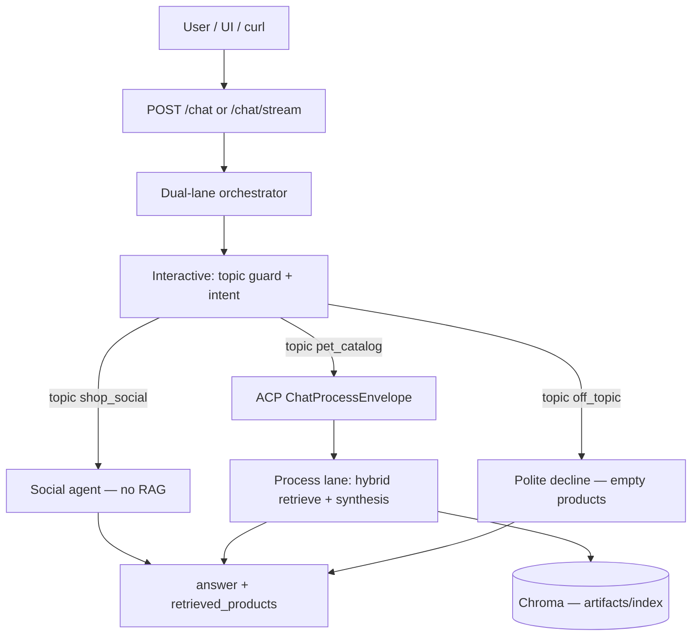
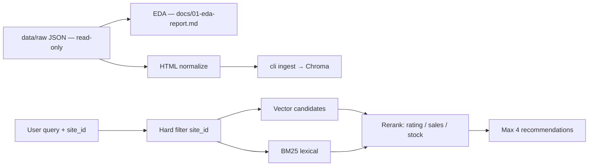
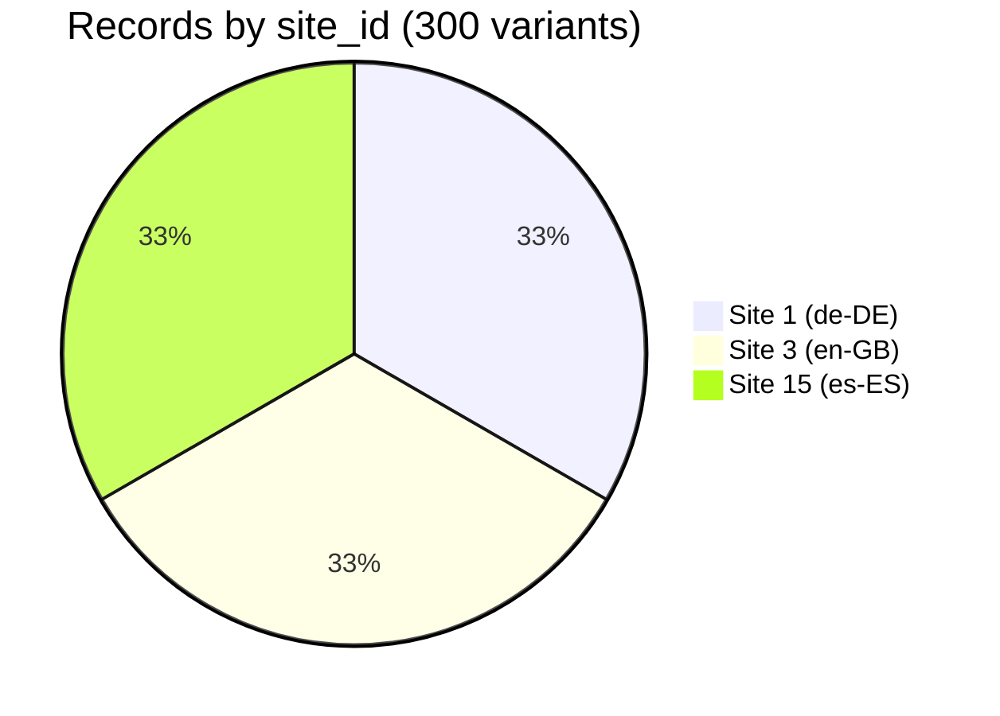

# zooplus Assistant PoC — Interview Defense Pack (English)

**Purpose:** Defend the take-home in a Senior AI Engineer (Agentic Commerce) interview with **traceability**, **evidence**, and **clear trade-offs** — not feature count.

**PoC status:** Complete on `main`. This document is your **spoken narrative + slide/diagram source + screenshot plan**.

---

## 1. One-minute pitch

> I built **zooplus Assistant**: an **async FastAPI** chat API that answers **dog and cat product** questions using **RAG only** on the provided JSON catalog, scoped by **`site_id`**, with a **default-deny topic guard** and **agent-first** routing (intent → social or catalog process lane).  
> I treated it as a **4–6 hour PoC with production mindset**: typed API contract, layered `cli/` + `src/`, documented constraints, **463 automated tests**, and a **170-case** matrix grounded in the original catalog — every `article_id` in responses is verified against the dataset.

---

## 2. Source of truth (what `instructions/` and `order/` mean)

| Location | Role in the PoC |
|----------|------------------|
| **`docs/instructions/`** | **Behavioral truth** — how the assistant must act |
| `AGENT_BUNDLE.md` | Lanes, topics, handoff, anti-patterns |
| `ACCEPTANCE.md` | Requirement IDs B1–B9, policies P1–P3 |
| `USE_CASES.md` | Human-readable index of the validation matrix |
| `AGENTIC_SOCIAL.md` | Intent/social/process architecture |
| **`docs/instructions/order/`** | **Original delivery** — immutable catalog snapshot from the client (`product_catalog_dataset.json`, 300 rows) |
| **`data/raw/product_catalog_dataset.json`** | Runtime copy (byte-identical to instructions catalog for ingest) |
| **`docs/instructions/Coding Task.docx`** | Original brief (API, guardrails, README expectations) |
| **`tests/` + `docs/trace/`** | Proof — acceptance, 170 E2E matrix, step journal |

**Interview line:** *“Requirements live in `instructions/`; `order/` is the catalog as received; the code never mutates raw JSON — only `artifacts/`.”*

---

## 3. Requirement traceability (Coding Task → evidence)

| ID | Brief requirement | How we satisfy it | Show interviewer |
|----|-------------------|-------------------|------------------|
| **B1** | Async FastAPI | `async def` routes, non-blocking lanes | `src/api/routes/chat.py` |
| **B2** | `POST /chat` `{ site_id, query }` | Pydantic models + OpenAPI | Swagger `/docs` or curl |
| **B3** | `{ answer, retrieved_products }` | Strict schema | Sample JSON response |
| **B4** | RAG **only** from dataset | Chroma index from `data/raw`; no web tools in answer path | `docs/02-rag-architecture.md` |
| **B5** | Multi-shop `site_id` | Hard filter before rank; 100 rows per site 1/3/15 | EDA table + site isolation test |
| **B6** | Pet-only; polite decline | Topic guard + `constraints.yaml` | Off-topic UI screenshot |
| **B7** | Production-oriented layout | `cli/`, `src/`, `src/guardian/`, `.opencode/agents/` | Repo tree slide |
| **B8** | README + runnable repo | `README.md`, `docker compose`, `run_dev.ps1` | Live demo |
| **B9** | Rigor, RAG reasoning, trade-offs | EDA, 463 tests, 170 matrix, README trade-offs | This doc + `CODING_TASK_VALIDATION.md` |

**Extensions (proposal v2 — good “senior” talking points):** dual-lane latency, MCP tools on host, ACP dispatch, OpenCode agent definitions — see `docs/00-brief-alignment.md` rows X1–X4.

---

## 4. Architecture diagrams (export for slides)

Copy any block to [https://mermaid.live](https://mermaid.live) → PNG/SVG for slides.

### 4.1 End-to-end request flow



### 4.2 Agent graph (AGENT_BUNDLE)

```mermaid
flowchart LR
  INT[@zooplus-intent-agent]
  INT -->|shop_social| SOC[@zooplus-social-agent]
  INT -->|pet_catalog| RAG[@zooplus-rag-worker]
  RAG --> LOG[@zooplus-logic-worker]
  LOG --> SYN[@zooplus-synthesis]
  INT -->|off_topic| DEC[Decline template]
  CON[@zooplus-conductor] -. orchestrates .-> INT
```

**Talking point:** Intent classifies by **topic**, not single keywords; handoff string tells downstream agents what the user is discussing (`src/agents/handoff.py`).

### 4.3 RAG pipeline (filter-then-score)



### 4.4 Data model (catalog)



| Metric | Value |
|--------|-------|
| Variant records | **300** |
| Unique products | **154** |
| Pet split | **150 DOGS / 150 CATS** |
| Food-like rows (ingredients/feeding) | **223** |

---

## 5. Validation evidence (numbers to quote)

| Evidence | Value | Where |
|----------|-------|--------|
| Automated tests | **463** collected | `pytest tests/` |
| Use-case matrix (E2E `/chat`) | **170** cases | `docs/trace/sessions/use-case-matrix-latest.json` |
| Matrix grounded in catalog | `catalog_ref` + runtime `(site_id, article_id)` check | `tests/acceptance/test_use_cases_matrix_catalog.py` |
| Brief acceptance | B1–B9 | `tests/acceptance/test_coding_task_brief.py` |
| Quality gates | `run_quality_gates.py` | `docs/DEMO.md` checklist |
| Last matrix run | pytest exit **0** | `use-case-matrix-latest.json` timestamp |

**Regenerate before interview:**

```bash
python scripts/build_use_case_matrix.py
python scripts/run_use_case_matrix.py
python scripts/export_interview_evidence.py   # writes docs/interview/EVIDENCE_SNAPSHOT.md
```

---

## 6. Screenshot & capture checklist (for slides)

Run server: `.\scripts\run_dev.ps1` or `docker compose up -d` → **http://127.0.0.1:8080/ui/**

| # | Capture | What it proves | Steps |
|---|---------|----------------|-------|
| **S1** | Chat UI — identity | B3 social lane, no product cards | Site **3**, query: `hello, who are you` |
| **S2** | Chat UI — services/help | Topic `shop_social`, not decline | `what can you tell me about your services` |
| **S3** | Chat UI — catalog | B4+RAG, ≤4 products | `show me some options about cats and dogs` |
| **S4** | Chat UI — guardrail | B6 decline, empty products | `how is the traffic today` |
| **S5** | Chat UI — brief example | Coding Task sample | `best dry food for puppy` (site 3) |
| **S6** | OpenAPI `/docs` | B2 contract | Browser: `http://127.0.0.1:8080/docs` |
| **S7** | Terminal — tests green | B9 rigor | `pytest tests/ -q` last line `463 passed` |
| **S8** | Terminal — matrix | 100+ cases | `python scripts/run_use_case_matrix.py` summary |
| **S9** | Repo tree | B7 structure | VS Code: `cli/`, `src/`, `.opencode/agents/`, `docs/instructions/` |
| **S10** | EDA / architecture docs | Data understanding | `docs/01-eda-report.md` + `02-rag-architecture.md` in editor |
| **S11** | Docker (optional) | Deployability | `docker compose ps` + `deploy_smoke.py` OK |
| **S12** | Stream (optional) | Latency design | `POST /chat/stream` NDJSON in `RUNBOOK.md` |

**Naming files:** `slide-01-ui-identity.png`, … `slide-08-pytest-463-passed.png`.

---

## 7. Demo script (5 minutes, live or recorded)

1. **30 s — Problem:** Multi-shop pet catalog assistant; knowledge **only** from JSON; must refuse off-topic.  
2. **60 s — Architecture:** Show diagram §4.1; mention filter-then-score and agent topics.  
3. **2 min — UI:** Run S1→S4 queries in order; point at `retrieved_products` length (0 vs 1–4).  
4. **60 s — Quality:** Open `USE_CASES.md` or terminal matrix pass; mention **463 tests**.  
5. **30 s — Trade-offs:** Chroma local, template vs OpenCode synthesis, max 4 recs — **roadmap** in README.

---

## 8. Trade-offs & production roadmap (expect these questions)

| Choice | Why for PoC | Production next step |
|--------|-------------|----------------------|
| **Chroma in-process** | Zero infra, fast setup | Managed vector DB (Qdrant, Vertex Matching Engine) |
| **Hybrid retrieval** | Better SKU/brand match than vector-only | Learned reranker + eval harness (RAGAS) |
| **Template synthesis default** | Reproducible demo without API keys | LLM gateway with caching + streaming |
| **Topic guard (rules + agent)** | Low latency, deterministic declines | Dedicated classifier + audit log |
| **Max 4 products** | UX + `constraints.yaml` P1 | Configurable cap per channel |
| **170-case matrix** | Proves brief + catalog grounding | CI gate on every PR |

**Strong close:** *“I optimized for **evaluability**: every requirement maps to a test or trace step, and every product ID in the response is checked against the catalog.”*

---

## 9. Likely Q&A (short answers)

**Q: How do you prevent hallucinated products?**  
A: Retrieval-only context for catalog lane; synthesis must cite `retrieved_products`; tests assert `(site_id, article_id)` exists in `product_catalog_dataset.json`.

**Q: How is `site_id` enforced?**  
A: Metadata filter on Chroma **before** ranking; integration tests for cross-shop leakage.

**Q: Why agents if it’s a small PoC?**  
A: The brief is **agentic commerce**; separates topic decision, social UX, and RAG process — matches `AGENT_BUNDLE` and OpenCode agent files for clear ownership.

**Q: What would you do with more time?**  
A: Observability (p95 per lane), streaming UX, managed embeddings, RAGAS on the 170 matrix, feature-flagged LLM provider.

**Q: Is it “finished” or over-engineered?**  
A: Core brief is **done and tested**; MCP/ACP/dual-lane are **documented extensions** that show production thinking without blocking the take-home scope.

---

## 10. File map for reviewers

| Interviewer asks for… | Open |
|---------------------|------|
| Original behavior spec | `docs/instructions/AGENT_BUNDLE.md` |
| Acceptance criteria | `docs/instructions/ACCEPTANCE.md` |
| Original catalog | `docs/instructions/order/product_catalog_dataset.json` |
| Use-case list | `docs/instructions/USE_CASES.md` |
| Validation how-to | `docs/CODING_TASK_VALIDATION.md` |
| Demo steps | `docs/DEMO.md` |
| Brief checklist | `docs/00-brief-alignment.md` |
| Implementation journal | `docs/trace/PROGRESS.md` |

---

## 11. Pre-interview checklist

- [ ] `git pull` on `main`
- [ ] `python -m cli ingest` (if index missing)
- [ ] Server up — `/health` → 200
- [ ] Capture S1–S8 screenshots
- [ ] Run `python scripts/export_interview_evidence.py` and attach `EVIDENCE_SNAPSHOT.md`
- [ ] Rehearse §1 pitch + §7 demo once in English

**You are defending engineering judgment, not perfection.** The PoC is ready when the brief rows in §3 are backed by §5 evidence and §6 captures.
