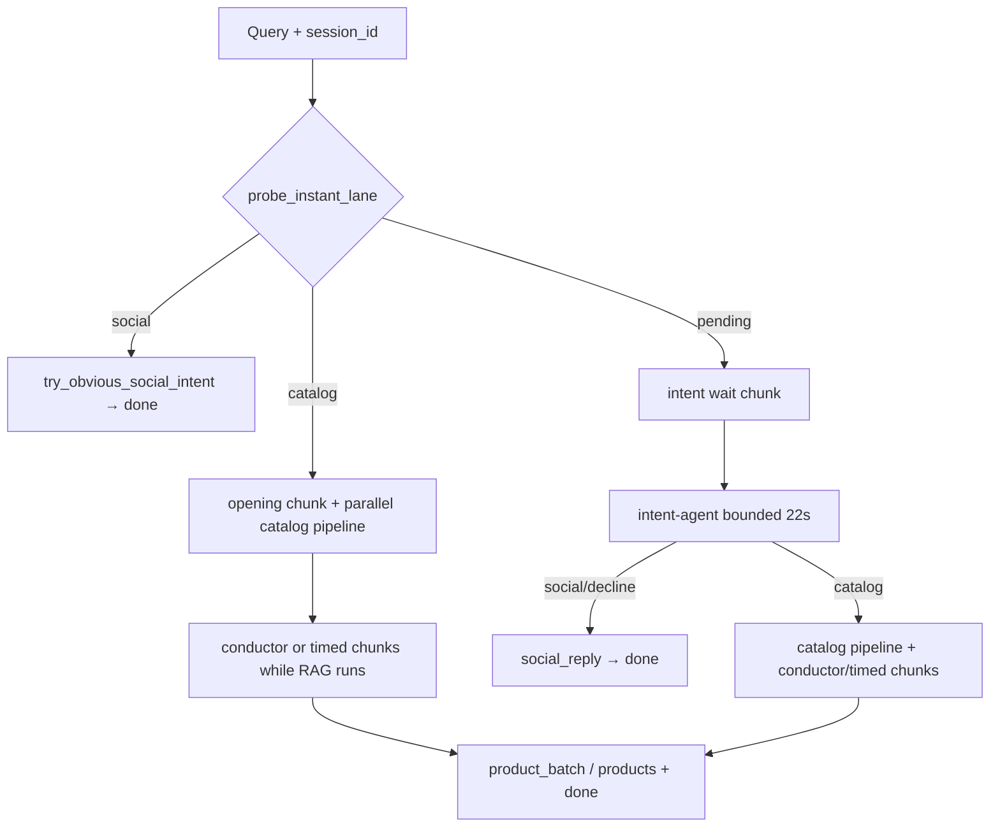

# Project features — zooplus Assistant PoC

**Line:** `releases` / `main` @ **v2.1.6**  
**Last aligned with codebase:** 2026-06-09  
**Related:** [`README.md`](../README.md) · [`PROJECT_WORK_HISTORY.md`](PROJECT_WORK_HISTORY.md) · [`02-rag-architecture.md`](02-rag-architecture.md) · [`CHANGELOG_v2.1.4_to_v2.1.6.md`](deliverables/v0.1/CHANGELOG_v2.1.4_to_v2.1.6.md)

Capability inventory for the **current** implementation — shopper-visible behavior, API contract, agentic stack, RAG, guardrails, and DevEx. For the commit-by-commit story see the work history; for interview slides see the deliverable pack.

---

## At a glance

| Area | What ships today |
|------|------------------|
| **Brief** | FR1–FR5 (async API, RAG grounding, pet guardrails, production layout) |
| **Catalog** | Hybrid Chroma+BM25, `site_id` filter, EUR price bands, 4 default / 20 max picks |
| **Agentic** | Intent-agent first, invisible conductor stream, 7 OpenCode roles + template fallbacks |
| **Social** | Phrase index + playbook, fast probe, shopping+help → catalog, CUSTOMER_VOICE |
| **Stream** | NDJSON: `typing` → `chunk*` → `topic` → `product_batch*` / `products` → `done` |
| **UI** | `/ui/` shop picker, live stream, model badge from real `meta`, optional model override |
| **Ops** | Wizard, Docker, smoke/verify scripts, quality gates, optional Redis cache |

---

## 1. Coding Task — FR1–FR5

| ID | Requirement | Implementation |
|----|-------------|----------------|
| **FR1** | Async FastAPI `POST /chat` | `src/api/routes/chat.py` — `async def`; Chroma + OpenCode in `asyncio.to_thread` |
| **FR2** | `{ answer, retrieved_products }` (+ `meta`) | `src/models/chat.py` — Pydantic contract; stream `done` event matches |
| **FR3** | RAG on provided JSON only | `data/raw/product_catalog_dataset.json` → Chroma; `must_ground_in_retrieval` |
| **FR4** | Pet-catalog guardrails | `src/guardian/constraints.yaml` default-deny; decline/social skip retrieval |
| **FR5** | Production-oriented repo | `src/`, `cli/`, Docker, tests, runbook, wizard, CI quality gates |

**Acceptance query** (B1–B3 demo):

```json
{
  "site_id": 3,
  "query": "What's the best dry food for a puppy with a sensitive stomach?"
}
```

**Policies (acceptance):** P1 default 4 / max 20 picks · P2 decline → empty list · P3 300 variants ingested.

---

## 2. Shopper-facing capabilities (v2.1.6)

### 2.1 Catalog recommendations

| Feature | Behavior |
|---------|----------|
| Hybrid search | Semantic (Chroma) + BM25 on candidate pool + business rerank |
| Shop scope | Hard filter `site_id` — Germany `1`, UK `3`, Spain `15` |
| Pick count | Default **4**; parses natural language counts (ES/EN/DE/FR words & digits) up to **20** |
| Price filter | EUR bands — `between 40 and 60`, `entre X y Y`, etc. (`src/rag/price_filter.py`) |
| Species | Dynamic inference for in-scope and out-of-scope pets (e.g. iguanas) — no fixed whitelist |
| Grounding | Synthesis only from retrieved hits; template fallback on LLM timeout |
| Empty retrieval | Policy message from `constraints.yaml`; no invented SKUs |

### 2.2 Conversational (no catalog)

| Feature | Behavior |
|---------|----------|
| Greetings / thanks / pure help | Social lane — no Chroma, no catalog progress chunk |
| **Shopping + help** | `has_shopping_request()` wins — e.g. “light food for dogs… can you help?” → **catalog** |
| Off-topic | Weather, news, competitors, non-pet, injection patterns → polite decline |
| **CUSTOMER_VOICE** | Professional associate tone; no search/RAG/strategy exposition (`src/agents/prompts.py`) |
| Language | Query language → `Accept-Language` → shop locale (`bind_shopper_language_async`) |
| Greeting quality | First-turn `hello` preserved; mid-session intro dedupe (`stream_voice_registry.py`) |
| Social kinds | `greeting`, `identity`, `thanks`, `help`, `bye`, `clarify` |

### 2.3 Live demo script (slide 9 / PPT)

| Step | Query (shop 15) | Expected |
|------|-----------------|----------|
| A | `can you help me` | Social help — **no** “searching catalog” chunk |
| B | `and what about iguanas` | Scope reply — no duplicate greeting intro |
| C | `give me 10 dog food options` | Up to 10 cards via **`product_batch`** waves |
| Extra | `hello` (shop 3) | Natural full greeting |
| Extra | `looking for light food for my dogs… can you help me out?` | **Catalog**, not help FAQ |

---

## 3. Streaming protocol (`POST /chat/stream`)

**Media type:** `application/x-ndjson` (one JSON object per line).

### 3.1 Event types (actual code)

| Event | Payload highlights |
|-------|-------------------|
| `typing` | `{ chunk, active }` — indicator before a bubble |
| `chunk` | `{ chunk, elapsed_s, text }` — progress / social copy from backend |
| `topic` | `{ decision: ALLOW\|DECLINE, reason_code }` — lane metadata |
| `product_batch` | `{ batch, retrieved_products[] }` — cards in groups of **4** when total > 4 |
| `products` | `{ retrieved_products[] }` — all cards at once when ≤ 4 |
| `done` | `{ answer, retrieved_products, meta }` — final contract |

> Note: v2.1.6 stream uses **`chunk`**, not a separate `status` event type.

### 3.2 Three routing paths (`src/lanes/stream.py`)



1. **Social probe** — phrase index / playbook says social → immediate social reply (intent task cancelled).
2. **Catalog probe** — obvious catalog → catalog opening chunk + **parallel** retrieval/synthesis while intent still runs; re-route to social if intent disagrees.
3. **Pending** — optional wait chunk while `zooplus-intent-agent` classifies → then catalog or social path.

**Session safety:** `session_id` + turn counter — new message **cancels** in-flight stream (`src/cache/session_turn.py`).

**Stream modes:**

| Mode | Env | Behavior |
|------|-----|----------|
| **Conductor** (default) | `ZOOPLUS_STREAM_MODE=conductor` | Invisible `zooplus-conductor` ticks; `ZOOPLUS_CONDUCTOR_FAST_STATUS=1` uses lightweight status text |
| **Timed** (fallback) | `ZOOPLUS_STREAM_MODE=timed` | v1.4-style social chunk every `ZOOPLUS_CHUNK_INTERVAL_SECONDS` (default 5s) |

**UX pacing:** `ZOOPLUS_CHUNK_MIN_TYPING_SECONDS`, `ZOOPLUS_CHUNK_MIN_PAUSE_SECONDS`; UI reveals `product_batch` before final `done`.

---

## 4. Blocking API (`POST /chat`)

- Same `{ site_id, query, preferred_model?, session_id? }` body.
- Classify → (prefetch catalog hits in parallel if `catalog_search`) → process lane → JSON response.
- **TTL chat cache** when `ZOOPLUS_CACHE=1` — repeat identical `site_id`+query returns cached response (`src/cache/ttl_cache.py`).
- Swagger at `/docs` — FR1 async evidence.

---

## 5. Agentic orchestration

### 5.1 Lanes

| Lane | Retrieval | `retrieved_products` |
|------|-----------|----------------------|
| `conversational` | No | `[]` |
| `decline_off_topic` | No | `[]` |
| `catalog_search` | Yes | 4–20 grounded `RetrievedProduct` objects |

### 5.2 Classification stack

| Layer | Module | When |
|-------|--------|------|
| Phrase index | `phrase_index.py` + `social_phrases.yaml` | Fast social/help/greeting match (~90 seed phrases ES/EN/DE/FR) |
| Playbook | `conductor_playbook.md` (runtime learn) | Forbidden repeats, species labels, learned help lines |
| Stream probe | `probe_instant_lane()` | Before catalog ack (conductor mode only) |
| Intent agent | `zooplus-intent-agent` | **Primary** classifier (`ZOOPLUS_CONDUCTOR_INTENT=0` default) |
| Conductor intent | `zooplus-conductor` | Opt-in slow path (`ZOOPLUS_CONDUCTOR_INTENT=1`) |
| Topic fallback | `_fallback_intent_decision` | On intent timeout (22s) — no extra OpenCode round-trip |
| Lexicon repair | `ZOOPLUS_INTENT_REPAIR=1` | Opt-in catalog-signal repair when agent mis-declines |
| Fast regex paths | `ZOOPLUS_FAST_INTENT=1` | **Tests/CI only** — not production default |

### 5.3 OpenCode agents (`.opencode/config-cli/opencode.json`)

| Agent | Model (Go speed ladder) | Role |
|-------|-------------------------|------|
| `zooplus-conductor` | `opencode-go/minimax-m2.7` | Invisible stream orchestration |
| `zooplus-intent-agent` | `opencode-go/mimo-v2.5` | JSON lane classification |
| `zooplus-social-agent` | `opencode-go/deepseek-v4-flash` | Greetings, help, declines |
| `zooplus-topic-guard` | `opencode-go/qwen3.7-plus` | Scope / policy |
| `zooplus-rag-worker` | `opencode-go/deepseek-v4-pro` | Retrieval worker |
| `zooplus-logic-worker` | `opencode-go/minimax-m2.7` | Rank + cap fallback |
| `zooplus-synthesis` | `opencode-go/qwen3.6-plus` | Grounded catalog prose |

- **Per-request override:** `preferred_model` from UI debug selector.
- **Agent chains:** `ZOOPLUS_*_AGENT_CHAIN` env vars (see `.env.example`).
- **Cascade:** `ZOOPLUS_AGENT_CASCADE=1` — retries / fallbacks per role.
- **Fallbacks:** `ZOOPLUS_SYNTHESIS_MODE=template` deterministic answers; topic fallback for intent.

### 5.4 Process lane (catalog)

`ChatProcessEnvelope` → ACP `dispatch_process` → `run_process_lane` — price filter, cap slice, synthesis, sanitize answer, dedupe vs live stream chunks.

**Timeouts** (`constraints.yaml`): intent 22s · synthesis 18s · dispatch 40s.

---

## 6. RAG and data pipeline

| Component | Detail |
|-----------|--------|
| **Source** | `data/raw/product_catalog_dataset.json` (300 rows, never edited in place) |
| **Normalize** | HTML strip (`src/rag/normalize.py`) |
| **Chunking** | One document per sellable row |
| **Index** | Chroma collection `zooplus_variants` under `artifacts/index/chroma` |
| **Chroma ID** | `{site_id}:{locale}:{article_id}:{variant_id}` (+ `:dupN` if needed) |
| **Hybrid fusion** | ~50% vector + ~35% BM25 + ~15% business signals (`hybrid.py`, `rerank.py`) |
| **A/B** | `ZOOPLUS_RETRIEVAL_MODE=vector` |
| **Lexicon** | `routing_lexicon.json` from ingest — multilingual routing without hand-built pet lists |
| **Pool sizing** | Scales with requested count and price band (`retrieval_pool_size`) |
| **Quality** | Min hybrid score 0.30; weak signals → empty retrieval message |
| **Ingest CLI** | `python -m cli ingest` — idempotent rebuild |
| **Readiness** | `GET /ready` checks index directory |

**`RetrievedProduct` fields:** `article_id`, `product_id`, `variant_id`, `product_name`, `variant_name`, `price`, `currency`, `pet_type`, `brands`, `relevance_score`, `recommendation_reason`.

---

## 7. Guardrails and integration surfaces

- **Default-deny** — `allowed_intents` vs `decline_intents` in `constraints.yaml`.
- **No index on wrong lane** — social/decline never call `search_catalog`.
- **MCP tools** — `GET /mcp/tools`, `POST /mcp/tools/topic_check`, `POST /mcp/tools/catalog_search`.
- **ACP** — internal process dispatch (`src/acp/dispatcher.py`).
- **Answer sanitize** — strips tool JSON / orphan intros (`answer_sanitize.py`).
- **Metrics** — `GET /metrics` basic counters (`src/observability/metrics.py`).

---

## 8. Chat UI and runtime config

| URL | Purpose |
|-----|---------|
| `/ui/` | Chat UI (root `/` redirects here) |
| `GET /api/ui/config` | Shops, labels, synthesis mode, agent models, stream endpoint |
| `GET /api/ui/models` | OpenCode model list for debug selector (`?refresh=1`) |

**UI features:** shop selector (1/3/15), streamed bubbles, gradual product cards, agent/model badge from response `meta`, Enter-to-send, session id for stream cancellation.

---

## 9. API reference (complete)

| Method | Path | Notes |
|--------|------|-------|
| `POST` | `/chat` | Blocking JSON |
| `POST` | `/chat/stream` | NDJSON (UI default) |
| `GET` | `/health` | Liveness |
| `GET` | `/ready` | Chroma index present |
| `GET` | `/metrics` | Observability snapshot |
| `GET` | `/docs` | OpenAPI / Swagger |
| `GET` | `/ui/`, `/ui/{asset}` | Static chat assets |
| `GET` | `/api/ui/config`, `/api/ui/models` | UI bootstrap |
| `GET/POST` | `/mcp/tools/*` | MCP-compatible tools |

---

## 10. Runtime profiles and configuration

### Profile A — Template (CI / fastest)

```env
ZOOPLUS_INTENT_MODE=oracle
ZOOPLUS_SYNTHESIS_MODE=template
ZOOPLUS_AGENT_CASCADE=0
```

### Profile B — OpenCode agentic (interview demo, wizard default)

```env
ZOOPLUS_INTENT_MODE=agentic
ZOOPLUS_SYNTHESIS_MODE=opencode
ZOOPLUS_SOCIAL_SYNTHESIS=agentic
ZOOPLUS_AGENT_CASCADE=1
ZOOPLUS_CONDUCTOR_INTENT=0
```

### Key variables

| Variable | Default | Effect |
|----------|---------|--------|
| `ZOOPLUS_RETRIEVAL_MODE` | `hybrid` | `vector` for A/B |
| `ZOOPLUS_STREAM_MODE` | `conductor` | `timed` = v1.4 chunks |
| `ZOOPLUS_CONDUCTOR_INTENT` | `0` | `1` = opt-in conductor classification |
| `ZOOPLUS_CONDUCTOR_FAST_STATUS` | `1` | Lightweight conductor status chunks |
| `ZOOPLUS_CACHE` | `1` | In-process TTL cache |
| `ZOOPLUS_CACHE_BACKEND` | `memory` | `redis` + `ZOOPLUS_REDIS_URL` for shared cache |
| `ZOOPLUS_CACHE_TTL_SECONDS` | `600` | Cache TTL |
| `ZOOPLUS_CACHE_MAX_ENTRIES` | `128` | Cache size |
| `ZOOPLUS_FAST_INTENT` | `0` | Regex fast-path (tests only) |
| `ZOOPLUS_INTENT_REPAIR` | `0` | Lexicon repair after mis-decline |
| `ZOOPLUS_STREAM_VOICE_LEARN` | `1` | Playbook auto-learn |
| `ZOOPLUS_DEV_PORT` | `8090` | Dev server port |
| `ZOOPLUS_OPENCODE_TIMEOUT` | `15` | OpenCode subprocess cap |
| `ZOOPLUS_CHUNK_INTERVAL_SECONDS` | `5` | Timed mode interval |
| `ZOOPLUS_MAX_CHUNK_MESSAGES` | `5` | Max progress chunks per turn |

Full list: [`.env.example`](../.env.example).

---

## 11. Operations, testing, and delivery

| Tool | Purpose |
|------|---------|
| `scripts/setup_wizard.ps1` | Deps, ingest, OpenCode setup |
| `scripts/run_dev.ps1` | Uvicorn dev server |
| `scripts/smoke_minimal.ps1` | ~2 min smoke, no OpenCode |
| `scripts/run_release_verify.ps1` | Release verify incl. OpenCode social |
| `scripts/run_quality_gates.py` | ruff + unit + integration + e2e |
| `scripts/build_work_history.py` | Regenerate `PROJECT_WORK_HISTORY.md` |
| `docker compose up` | Containerized API |
| `python -m cli ingest` | Build / rebuild index |
| `python -m cli evaluate` | Golden query evaluation |

**Test coverage highlights:** acceptance B1–B9 · golden queries · intent oracle · stream smoke F1/F3 · security matrix (173 cases on `main`) · hybrid retrieval unit tests.

**Git promotion:** `feature/*` → `dev` → `main` → `releases`.

---

## 12. Documentation and deliverables

| Artifact | Branch | Path |
|----------|--------|------|
| **This feature catalog** | main + releases | `docs/PROJECT_FEATURES.md` |
| Work history | main + releases | `docs/PROJECT_WORK_HISTORY.md` |
| Interview PPT (14 slides, FR code panels) | releases | `docs/deliverables/v0.1/zooplus-assistant-interview-15min-pro.pptx` |
| Coding Task checklist | releases | `docs/deliverables/v0.1/CODING_TASK_CHECKLIST.md` |
| Changelogs | releases | `docs/deliverables/v0.1/CHANGELOG_*.md` |
| Future roadmap | releases | `docs/deliverables/v0.1/FUTURE_IMPROVEMENTS.md` |
| Q&A + speaker script | **main only** | `QA_FOR_POC.md`, `PRESENTATION_15MIN.md` |
| RAG deep dive | both | `docs/02-rag-architecture.md` |
| EDA report | main | `docs/01-eda-report.md` |

---

## 13. Version milestones

| Version | Capability added |
|---------|------------------|
| v1.0.0 | Dual-lane pipeline, Chroma ingest, topic guard |
| v1.1.0 | `/chat/stream` NDJSON |
| v1.2.0 | Hybrid BM25 + vector + rerank |
| v1.4.0 | Timed social chunks parallel to catalog |
| v2.0.0 | Invisible conductor orchestrator |
| v2.1.0–v2.1.3 | Playbook, lane probe, fast intent-first stream |
| v2.1.4 | Dynamic species inference, greeting dedupe |
| **v2.1.6** | Dynamic picks, `product_batch`, phrase index, CUSTOMER_VOICE, shopping+help routing, English PPT code panels |

---

## 14. Not in scope (PoC) — see roadmap

- Versioned constraints + prompt-injection scanner (P0)
- Structured intent facets before retrieval (`pet_type`, category) (P0)
- Managed vector DB + automated re-ingest / CDC (P1)
- Multi-shop `site_ids[]` in one request (P2)
- Photo search, voice channel, promo slots during stream (P2–P3)
- Cross-encoder reranker at millions-of-SKU scale

Details: [`FUTURE_IMPROVEMENTS.md`](deliverables/v0.1/FUTURE_IMPROVEMENTS.md).
