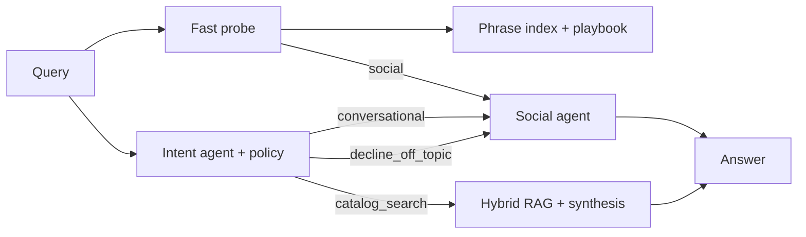

# Project features — zooplus Assistant PoC

**Version:** v2.1.6 (releases interview line)  
**Related:** [`README.md`](../README.md) · [`PROJECT_WORK_HISTORY.md`](PROJECT_WORK_HISTORY.md) · [`02-rag-architecture.md`](02-rag-architecture.md)

This document lists **what the project does** — shopper-facing capabilities and the technical features that implement them. It reflects the current codebase and the evolution captured in the work history.

---

## 1. Coding Task — functional requirements (FR1–FR5)

| ID | Feature | What it means in this repo |
|----|---------|----------------------------|
| **FR1** | Async FastAPI chat API | `POST /chat` and `POST /chat/stream`; `async def` handlers; blocking work (Chroma, OpenCode) in `asyncio.to_thread` |
| **FR2** | Structured response contract | `{ answer, retrieved_products, meta }` — same schema for blocking and streaming (`done` event) |
| **FR3** | Catalog-only RAG | Ingest from `data/raw/product_catalog_dataset.json`; answers grounded in `retrieved_products`; no invented SKUs |
| **FR4** | Pet-catalog guardrails | Default-deny topic guard; off-topic → polite decline, empty product list; no Chroma on decline/social lanes |
| **FR5** | Production-oriented layout | `src/`, `cli/`, Docker, tests, runbook, quality gates, setup wizard |

**Mandatory brief query** (acceptance / demo):

```json
{
  "site_id": 3,
  "query": "What's the best dry food for a puppy with a sensitive stomach?"
}
```

---

## 2. Shopper-facing features

### 2.1 Catalog search and recommendations

- Hybrid product search over the **300-variant** catalog (100 products × 3 shops).
- **Default 4** grounded recommendations; shopper can ask for more (up to **20**).
- **EUR price-band filtering** — parses ranges in multiple languages (`between`, `entre`, etc.).
- **Dynamic species inference** — handles dogs, cats, and unseen pets (e.g. iguanas) without a fixed species whitelist.
- **Shop-scoped results** — every query is filtered by `site_id` (Germany `1`, UK `3`, Spain `15`).
- Grounded synthesis — LLM or template answers only from retrieved hits; `must_ground_in_retrieval: true`.

### 2.2 Conversational assistant (non-catalog)

- **Greetings, thanks, pure help** — fast social lane, no RAG, no fake “searching catalog” progress.
- **Shopping + help in one message** — e.g. “light food for my dogs… can you help?” routes to **catalog**, not FAQ.
- **Off-topic decline** — weather, news, competitors, non-pet products → polite boundary, empty `retrieved_products`.
- **CUSTOMER_VOICE** — professional, concise replies; no internal strategy or tech exposition to shoppers.
- **Multilingual replies** — language detected from the shopper message; fallback to `Accept-Language`, then shop locale.
- **Mid-session dedupe** — strips repeated assistant intros; natural first-turn `hello`.

### 2.3 Streaming UX (`/chat/stream`)

| Event | Shopper experience |
|-------|-------------------|
| `typing` | Typing indicator between chunks |
| `chunk` / `status` | Real backend progress while intent/RAG runs (not fake client timers) |
| `topic` | Lane decision metadata (debug / UI badges) |
| `product_batch` | Product cards revealed in **batches of 4** when count > 4 |
| `products` | All cards at once when ≤ 4 picks |
| `done` | Final answer + full product list + `meta` |

**Stream modes:** `ZOOPLUS_STREAM_MODE=conductor` (default, invisible orchestrator) · `timed` (v1.4 fallback).

### 2.4 Chat UI

- Browser UI at `/ui/` — shop picker (Germany / UK / Spain), streamed bubbles, product cards.
- Optional **OpenCode model selector** (debug) — `preferred_model` in request body.
- Enter to send; backend-driven status bubble (single transient indicator).
- Static UI copy in **English**; agent replies follow shopper language.

---

## 3. Agentic orchestration

### 3.1 Lanes and routing



| Lane | RAG | Products |
|------|-----|----------|
| `conversational` | No | `[]` |
| `decline_off_topic` | No | `[]` |
| `catalog_search` | Yes | 4–20 grounded picks |

- **Conductor-first** — classify before Chroma (key latency win vs greeting → 30s RAG).
- **Fast probe** (`probe_instant_lane`) — phrase index routes obvious social/help before catalog chunks.
- **Intent agent** (`zooplus-intent-agent`) — primary classifier; conductor intent is **opt-in** (`ZOOPLUS_CONDUCTOR_INTENT=0` default).
- **Topic fallback** — on intent timeout/failure, rules-based routing without extra LLM round-trip.

### 3.2 OpenCode agents (per-role LLMs)

| Agent | Role |
|-------|------|
| `zooplus-conductor` | Invisible stream orchestration, playbook updates |
| `zooplus-intent-agent` | Lane classification |
| `zooplus-social-agent` | Greetings, help, thanks, declines |
| `zooplus-synthesis` | Grounded catalog answer from retrieved products |
| `zooplus-topic-guard` | Policy / scope checks |
| `zooplus-rag-worker` / `zooplus-logic-worker` | Retrieval and process-lane helpers |

- **One model per agent** in `.opencode/config-cli/opencode.json` (speed ladder).
- **Cascade fallbacks** — template synthesis, topic-based intent if OpenCode is slow or down.
- **Layered timeouts** — intent 22s, synthesis 18s, dispatch 40s (configurable in `constraints.yaml`).

### 3.3 Playbook and phrase index

- **`conductor_playbook.md`** — auto-learns species labels, help phrases, forbidden repeats (invisible to shoppers).
- **`social_phrases.yaml`** — ~90 curated ES/EN/DE/FR utterances; in-memory fast match; runtime merge with playbook.
- **Catalog-derived lexicon** (`routing_lexicon.json`) — brands/tokens from ingest for multilingual routing (no hardcoded dog/cat lists).

---

## 4. RAG and retrieval (technical)

| Feature | Detail |
|---------|--------|
| **Vector store** | Local Chroma (`artifacts/index/chroma`), collection `zooplus_variants` |
| **Chunking** | One document per catalog row (300 rows; no sub-chunking at PoC scale) |
| **HTML normalize** | `src/rag/normalize.py` strips tags before index |
| **Hybrid retrieval** | Chroma semantic + BM25 lexical on candidate pool + business-signal rerank (50% / 35% / 15%) |
| **Vector-only A/B** | `ZOOPLUS_RETRIEVAL_MODE=vector` |
| **Site filter** | Hard `where site_id = X` on every query (B5) |
| **Quality gates** | Min hybrid score 0.30; empty retrieval message from policy |
| **Idempotent ingest** | `python -m cli ingest` — safe rebuild |
| **Managed backend hook** | `ZOOPLUS_VECTOR_BACKEND=managed` placeholder for production |

**Metadata per vector:** `site_id`, `article_id`, `variant_id`, `pet_type`, `brands`, `price`, `stock_units`, `has_ingredients`.

---

## 5. Guardrails and policy

- **Default-deny firewall** — `src/guardian/constraints.yaml`; only `allowed_intents` pass.
- **Decline intents** — weather, datetime, general knowledge, non-pet, competitors.
- **No RAG on decline/social** — index not queried when lane is not catalog.
- **Prompt scope rules** — synthesis forbidden from inventing SKUs/prices.
- **MCP tools** (same host) — `topic_check`, `catalog_search` for external agent integration.
- **ACP process lane** — internal dispatch envelope for catalog processing.

---

## 6. API surface

| Endpoint | Purpose |
|----------|---------|
| `POST /chat` | Blocking JSON response |
| `POST /chat/stream` | NDJSON event stream (UI default) |
| `GET /health` | Liveness |
| `GET /ready` | Chroma index readiness |
| `GET /docs` | Swagger (FR1 evidence) |
| `GET /ui/` | Static chat UI |

**Request body:** `{ site_id, query, preferred_model? }`

**Response `meta` (when LLM runs):** `lane`, `intent_source`, `llm_agent`, `llm_model`, `dispatch_id`, etc.

---

## 7. Operations, DevEx, and quality

| Feature | Detail |
|---------|--------|
| **Setup wizard** | `scripts/setup_wizard.ps1` — deps, ingest, optional OpenCode login |
| **Dev launcher** | `scripts/run_dev.ps1` — uvicorn on `:8090` |
| **Docker** | `docker compose up` — containerized API |
| **Template profile** | `ZOOPLUS_SYNTHESIS_MODE=template` — CI without OpenCode |
| **Smoke scripts** | `smoke_minimal.ps1` (~2 min), `run_release_verify.ps1` (incl. OpenCode social) |
| **Quality gates** | `run_quality_gates.py` — ruff, unit, integration, e2e |
| **Acceptance suite** | B1–B9 + Coding Task matrix (173 use cases on main line) |
| **Golden queries** | Fixture + evaluate CLI for retrieval regression |
| **Git workflow** | `feature` → `dev` → `main` → `releases` |
| **Optional Redis** | `ZOOPLUS_CACHE_BACKEND=redis` — shared TTL cache across replicas |
| **In-process cache** | TTL cache for intent/retrieval (128 entries default) |

---

## 8. Configuration knobs (summary)

| Variable | Effect |
|----------|--------|
| `ZOOPLUS_SYNTHESIS_MODE=template` | Deterministic answers, no OpenCode |
| `ZOOPLUS_RETRIEVAL_MODE=vector` | Vector-only retrieval |
| `ZOOPLUS_CONDUCTOR_INTENT=1` | Opt-in conductor before RAG |
| `ZOOPLUS_STREAM_MODE=conductor` \| `timed` | Stream chunk strategy |
| `ZOOPLUS_CACHE_BACKEND=redis` | Shared cache |
| `ZOOPLUS_VECTOR_BACKEND=managed` | Placeholder for hosted vector DB |

---

## 9. Data and multi-shop

| Fact | Implication |
|------|-------------|
| 300 catalog rows | 3 shops × 100 variants |
| Shops | `1` de-DE, `3` en-GB, `15` es-ES |
| Pet types in data | Primarily DOGS / CATS |
| `site_id` required | B5 isolation — no cross-shop leakage in one request |

---

## 10. Documentation and deliverables

| Artifact | Location |
|----------|----------|
| Interview PPT (14 slides, FR code panels) | `docs/deliverables/v0.1/zooplus-assistant-interview-15min-pro.pptx` |
| Coding Task checklist | `docs/deliverables/v0.1/CODING_TASK_CHECKLIST.md` |
| Changelogs (v0.1 → v2.1.6) | `docs/deliverables/v0.1/CHANGELOG_*.md` |
| Future roadmap | `docs/deliverables/v0.1/FUTURE_IMPROVEMENTS.md` |
| Work history (narrative) | `docs/PROJECT_WORK_HISTORY.md` |
| Q&A + speaker script | `main` only — `QA_FOR_POC.md`, `PRESENTATION_15MIN.md` |

---

## 11. Version milestones (selected)

| Tag / line | Headline capability |
|------------|---------------------|
| v1.0.0 | Dual-lane pipeline, Chroma ingest, topic guard |
| v1.1.0 | `/chat/stream` NDJSON |
| v1.2.0 | Hybrid BM25 + vector + rerank |
| v1.4.0 | Timed social chunks parallel to catalog |
| v2.0.0 | Invisible conductor orchestrator |
| v2.1.3 | Fast intent-first stream |
| v2.1.4 | Dynamic species inference |
| **v2.1.6** | Dynamic picks, `product_batch`, phrase index, CUSTOMER_VOICE, shopping+help routing |

---

## 12. Explicitly out of scope (PoC) — see roadmap

- Managed vector DB in production
- Automated catalog re-ingest / CDC
- Prompt-injection scanner and versioned policy packs (P0 roadmap)
- Multi-shop search in one request (`site_ids[]`)
- Photo search, voice channel, promo slots during stream
- Cross-encoder reranker at scale

Full scale-out plan: [`FUTURE_IMPROVEMENTS.md`](deliverables/v0.1/FUTURE_IMPROVEMENTS.md).
