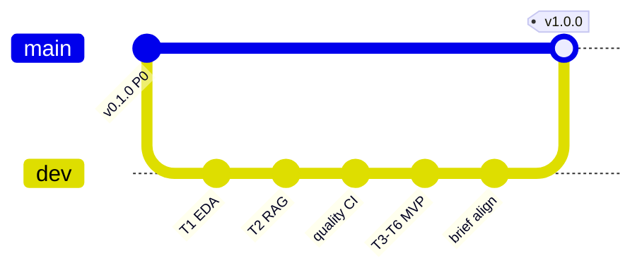

# Release and merge plan (`dev` → `main`)

**Repo:** [peluzzza/PoCAssistantZooplus](https://github.com/peluzzza/PoCAssistantZooplus)  
**Policy:** `feature/*` → `dev` (no approval). `dev` → `main` only when milestone exit criteria pass + `python scripts/run_quality_gates.py` + CI green.

---

## Milestone map

| Release | Tag | Source merge | Scope | Exit criteria | Status |
|---------|-----|--------------|-------|---------------|--------|
| **0.1.0** | `v0.1.0` | P0 bootstrap | Repo scaffold, trace, stub API | G0, health endpoint | **on `main`** (`a6f9d26`) |
| **0.2.0** | — | *(skipped)* | Would be EDA-only; folded into 1.0 | — | N/A |
| **1.0.0** | `v1.0.0` | `dev` → `main` @ `72bbc4e` | T0–T6: EDA, RAG, MCP, dual-lane, `/chat`, README | B1–B9 DONE, G2–G6, 19 tests, CI quality job green | **RELEASED** |
| **1.1.0** | `v1.1.0` | `dev` (in progress) | G1 load test, `/chat/stream`, golden fixtures | Golden: **done** (`evaluate` CLI + 4 cases); streaming + G1 pending | **IN PROGRESS** |
| **1.2.0** | `v1.2.0` | future `dev` | Hybrid retrieval, reranking, optional LLM synthesis | Integration tests for hybrid path | Planned |
| **2.0.0** | `v2.0.0` | future `dev` | Production profile: container, managed vector DB, observability | Deploy smoke + runbook | Planned |

---

## v1.0.0 — Minimum functional proven (MVP)

### Included (from `dev`)

- Async FastAPI `POST /chat` with `{ site_id, query }` → `{ answer, retrieved_products }`
- Chroma RAG ingest + site-scoped retrieval (no cross-shop leak)
- Topic guard + polite decline (weather, datetime, news, general knowledge)
- Dual-lane orchestrator + ACP dispatch
- MCP tools (`topic_check`, `catalog_search`)
- `.opencode/agents` + operator CLI (`eda`, `ingest`)
- Quality gates: Ruff + 10 unit + 7 integration + 2 e2e
- README, trace journal, brief alignment doc

### Explicitly out of v1.0.0 (later releases)

- External LLM API keys
- SonarCloud gate (optional `SONAR_TOKEN`)
- Streaming `/chat/stream`
- Hybrid BM25 + vector
- Production k8s / managed Chroma

### Pre-merge checklist (v1.0.0)

- [x] `docs/00-brief-alignment.md` — B1–B9 DONE
- [x] `python scripts/run_quality_gates.py` — pass
- [x] GitHub Actions `quality` job green on `dev`
- [x] `README.md` submission-ready
- [x] User authorized milestone merge to `main`

---

## Merge procedure (repeat per release)

```bash
# 1. From repo root on dev
git checkout dev && git pull origin dev
python scripts/run_quality_gates.py

# 2. Merge to main
git checkout main && git pull origin main
git merge dev -m "release: vX.Y.Z — <short title>"
git tag -a vX.Y.Z -m "vX.Y.Z — <short title>"

# 3. Push
git push origin main
git push origin vX.Y.Z

# 4. Record
# Update docs/trace/PROGRESS.md and docs/trace/sessions/<date>-release-vX.Y.Z.md
```

---

## Branch diagram (target state after v1.0.0)



---

## Next step after v1.0.0

Continue on `dev` with `feature/v1.1-streaming` or `feature/v1.1-golden-queries` — merge to `main` only when **1.1.0** row exit criteria are met.
