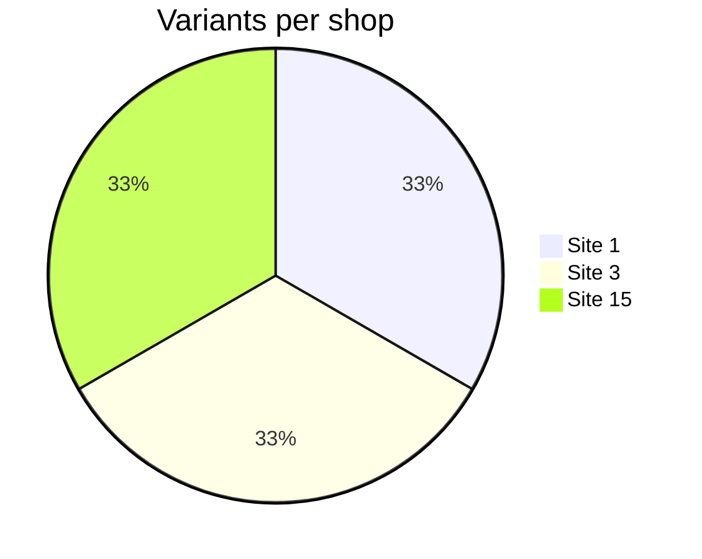
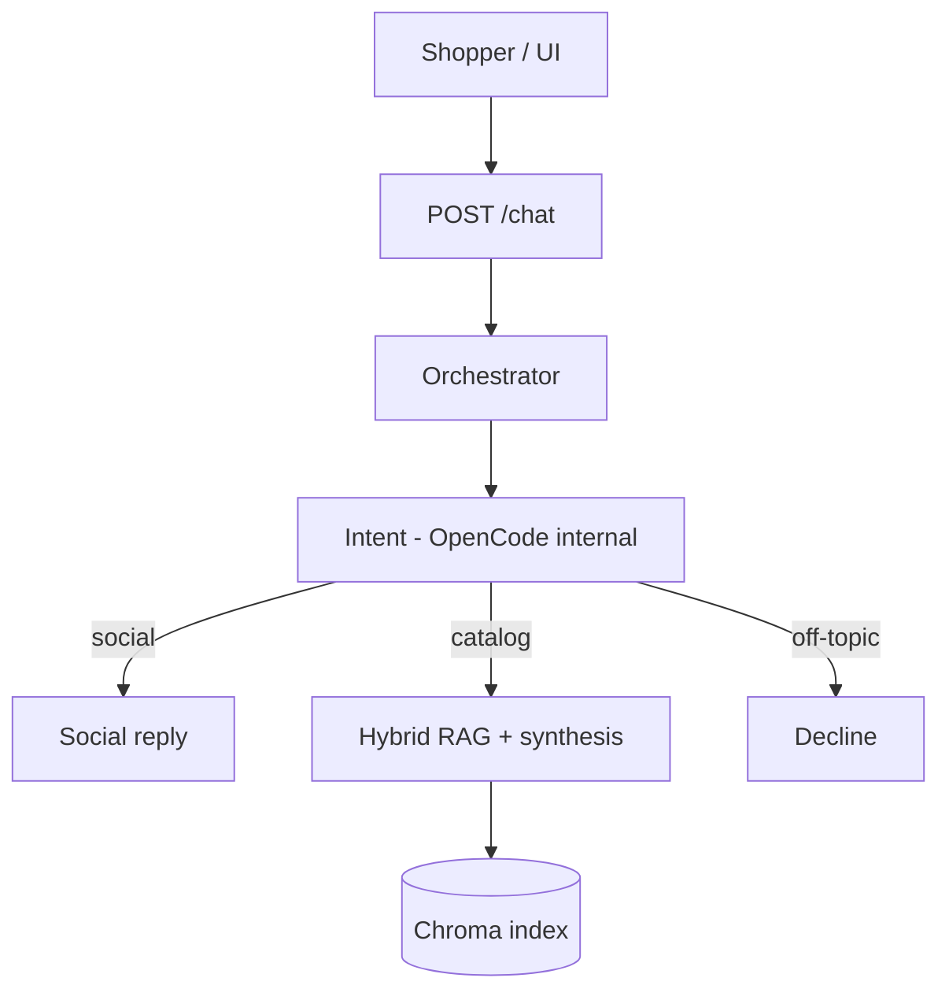

# Presentation base — zooplus Assistant PoC (v0.1)

Export diagrams from [mermaid.live](https://mermaid.live). Screenshots from **http://127.0.0.1:8090/ui/**.

---

## Slide 1 — Title

**zooplus Assistant** — agentic pet-shop chat (PoC)  
RAG on fixed catalog · 3 shops · dogs & cats only  
Your name · v0.1.0 · `releases`

---

## Slide 2 — Problem (Coding Task)

- Answer product questions from **provided JSON only** (no web).
- Scope by **`site_id`** (1, 3, 15).
- **Decline** off-topic (weather, humans, …).
- Contract: `POST /chat` → `{ answer, retrieved_products }`.

---

## Slide 3 — Catalog

| | |
|--|--|
| 300 variants | 100 per shop |
| Pets | DOGS + CATS only |
| API | `site_id` + natural language `query` |

---

## Slide 4 — Architecture

**Note:** User sees only **zooplus Assistant** — agents are internal.

---

## Slide 5 — B1–B6 demo (screenshots)

| Shot | Query | Proves |
|------|-------|--------|
| A | `hello` | B3 social, no cards |
| B | `cat food options` | B4 RAG + cards (≤4) |
| C | site **1** vs **3** | B5 isolation |
| D | `products for humans` | B6 decline |

---

## Slide 6 — B7–B9 engineering

- **Layout:** `cli/`, `src/`, `tests/`, Docker
- **Quality:** `run_release_verify.ps1` (unit + integration + agentic + social)
- **Trade-offs:** hybrid retrieval; OpenCode for intent/synthesis; template-free runtime on `releases`

---

## Slide 7 — Requirement matrix

Use table from [`CODING_TASK_CHECKLIST.md`](CODING_TASK_CHECKLIST.md) — all B1–B9 ticked with live + test evidence.

---

## Slide 8 — Code excerpt (optional)

- `src/lanes/orchestrator.py` — intent → social | process
- `src/rag/retrieve.py` — `site_id` filter
- `static/ui/app.js` — shopper UI

---

## Slide 9 — Q&A / limits

- No horses / humans in catalog data.
- OpenCode required for full agentic path locally.
- PoC: single-node Chroma, not multi-region prod.

---

## One-minute pitch (speaker notes)

> I built zooplus Assistant: async FastAPI + RAG on the 300-row catalog, scoped by site_id, with default-deny guardrails and agentic routing. The shopper only sees one assistant; OpenCode handles intent and answers internally. I validated B1–B9 against the Coding Task checklist and run real LLM tests without mocks on integration and social suites.
