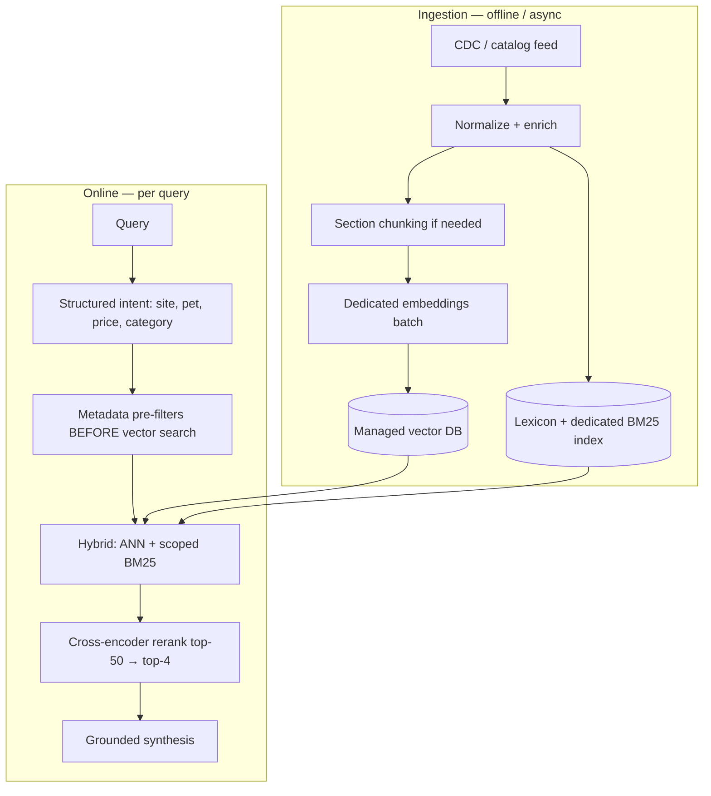

# Q&A for PoC — interview preparation

**Purpose:** Likely interviewer questions, recommended answers, live-demo talking points, and scale-out strategy — grounded in this repository.

**Related:** [`PRESENTATION_15MIN.md`](PRESENTATION_15MIN.md) · [`FUTURE_IMPROVEMENTS.md`](FUTURE_IMPROVEMENTS.md) · [`CODING_TASK_CHECKLIST.md`](CODING_TASK_CHECKLIST.md)

---

## How interviewers typically probe

| Axis | What they look for |
|------|-------------------|
| **Understanding** | Do you own the design or only repeat patterns? |
| **Trade-offs** | Do you know what you sacrificed and why? |
| **Production mindset** | Scale, failures, latency, security |
| **Data awareness** | Dataset implications (shops, locales, HTML, prices) |
| **Live demo** | Can you explain flow under pressure? |

---

## RAG and retrieval

### Q1 — Why RAG instead of fine-tuning the LLM on the catalog?

**Recommended answer:**

> “With 300 variants that differ by shop, price, and stock, RAG is cheaper and safer: the model does not memorize SKUs. Every answer is anchored to `retrieved_products` from the index. Fine-tuning does not guarantee grounding or `site_id` isolation, and retraining on every catalog update does not scale operationally.”

---

### Q2 — Why hybrid retrieval (Chroma + BM25) instead of vectors alone?

**Recommended answer:**

> “Vectors capture semantics — ‘wet food for kitten’ ≈ ‘kitten wet food’. Shoppers also use exact tokens: brands, ‘grain-free’, SKUs. BM25 over Chroma’s candidate pool adds lexical precision without a second database. We fuse 50% vector, 35% lexical, and 15% business signals — rating, sales, stock.”

**Code:** `src/rag/hybrid.py`, `src/rag/rerank.py`

---

### Q3 — Why one document per row instead of chunking?

**Recommended answer:**

> “EDA showed 300 rows; each row is already a sellable variant with full metadata. Further chunking adds noise and reconciliation complexity without benefit at this size. At scale I would chunk by section — ingredients, feeding — with a parent product id.”

**Doc:** `docs/01-eda-report.md`, `docs/02-rag-architecture.md`

---

### Q4 — What happens when retrieval finds nothing?

**Recommended answer:**

> “Quality gates: minimum hybrid score 0.30, nonsense-query detection, and empty results when BM25 and vector signals are both weak. The shopper sees `empty_retrieval_message` from `constraints.yaml`. We never invent products — `must_ground_in_retrieval: true`.”

---

### Q5 — How do you prevent hallucinated prices or brands?

**Recommended answer:**

> “Three layers: (1) only real index hits go to synthesis; (2) the `zooplus-synthesis` prompt forbids inventing SKUs/prices; (3) deterministic template fallback on timeout or LLM error. Acceptance test B4 verifies grounding against the instructions catalog.”

---

### Q6 — Why cap at four recommendations?

**Recommended answer:**

> “Policy P1 in `src/guardian/constraints.yaml` — clear UX aligned with the brief. In production this could be channel-specific; for the PoC we prioritized quality over quantity.”

---

## Service architecture

### Q7 — Walk us through `POST /chat`.

**Recommended answer:**

> “FastAPI receives `{site_id, query}`. The orchestrator classifies intent conductor-first. Off-topic → social agent, empty `retrieved_products`. Conversational → social, no Chroma. Catalog → hybrid prefetch in a thread, process lane with price filter, synthesis, response with `meta` (lane, model). Blocking work — Chroma, OpenCode — runs in `asyncio.to_thread` so the event loop stays async (FR1 / B1).”

**Code:** `src/lanes/orchestrator.py`, `src/api/routes/chat.py`

---

### Q8 — What is conductor-first routing and why did you add it?

**Recommended answer:**

> “In v0.1.3 we saw greetings triggering RAG and taking 30+ seconds. Conductor-first classifies the topic **before** Chroma. Greetings and off-topic use social/decline lanes. Only `catalog_search` pays retrieval cost. The shopper still sees one assistant and one `/chat` contract.”

---

### Q9 — Why multiple OpenCode agents instead of one prompt?

**Recommended answer:**

> “Separation of concerns: fast models for routing and social, stronger model for synthesis, cascade fallbacks per role. Different timeouts per stage. `meta` exposes which agent and model actually ran.”

**Config:** `.opencode/config-cli/opencode.json`

---

### Q10 — What is `/chat/stream` and why NDJSON?

**Recommended answer:**

> “Same body as `/chat`, but emits events: `status` → `topic` → `products` → `done`. NDJSON is easy to consume from the browser without WebSockets. Status text is backend-driven (`shopper_status` from the conductor), not fake client timers.”

**Code:** `src/lanes/stream.py`, `static/ui/app.js`

---

## Data and multi-shop

### Q11 — Why is `site_id` critical?

**Recommended answer:**

> “The dataset has three shops: 1 de-DE, 3 en-GB, 15 es-ES — 100 products each. Without a hard Chroma filter (`where site_id = X`) you could recommend products not sold in the user’s shop. That is requirement B5; we demo it by switching shop in the UI.”

---

### Q12 — How do you handle German, English, and Spanish?

**Recommended answer:**

> “We do not hardcode dog/cat word lists. Ingest builds `routing_lexicon.json` from catalog brands and tokens. The conductor and intent agents use that lexicon in prompts. The social agent replies in the shopper’s language; static UI copy stays English by PoC product choice.”

**Code:** `src/rag/catalog_lexicon.py`, `src/agents/intent_hints.py`

---

### Q13 — How does “cat food between 40 and 60 euros” work?

**Recommended answer:**

> “Intent lane is `catalog_search`. Hybrid retrieval with an enlarged pool (up to 24 hits when a price band is detected). `price_filter.py` parses EUR ranges in multiple languages (`between`, `entre`, etc.). Then cap at four and grounded synthesis.”

---

## Guardrails and security

### Q14 — How is FR4 implemented (pet catalog only)?

**Recommended answer:**

> “Default-deny in `constraints.yaml`: only allowed intents pass. The conductor classifies semantically; on failure or timeout, topic-guard rules apply. Off-topic returns a polite decline and `retrieved_products: []` — the index is not queried on decline/social lanes.”

---

### Q15 — What about prompt injection?

**Recommended answer:**

> “The PoC has policy in constraints and scope rules in prompts. **Honestly**, production needs roadmap P0: versioned constraints, injection scanner, and security CI. I would not claim that is fully solved today — it is planned.”

**Doc:** `docs/deliverables/v0.1/FUTURE_IMPROVEMENTS.md` (item #2)

---

### Q16 — Competitors, weather, news?

**Recommended answer:**

> “Listed under `decline_intents`. Same path as other off-topic queries: decline, no products. Consistent with an owned-catalog brief.”

---

## Operations, failures, and testing

### Q17 — What if OpenCode is down or slow?

**Recommended answer:**

> “Layered timeouts: intent 22s, synthesis 18s, dispatch 40s. Synthesis failure → template fallback. Intent timeout → topic fallback without another OpenCode round-trip. The API still responds; `meta` shows template vs LLM.”

---

### Q18 — How do you test without an LLM in CI?

**Recommended answer:**

> “Template profile: `ZOOPLUS_SYNTHESIS_MODE=template`. Intent oracle fixture for deterministic tests. Acceptance suite B1–B9 plus golden queries. `run_quality_gates.py` and smoke scripts without OpenCode.”

---

### Q19 — How do you know the index is ready?

**Recommended answer:**

> "`GET /ready` checks the Chroma index directory. Ingest is idempotent: deletes and recreates collection `zooplus_variants`. Manifest records 300 records in `artifacts/index/manifest.json`."

---

### Q20 — Why local Chroma instead of Pinecone / Weaviate?

**Recommended answer:**

> “Conscious PoC trade-off: zero external infra, minutes to set up, ideal for take-home. Code has `ZOOPLUS_VECTOR_BACKEND=managed` as a placeholder. Production would move to a managed vector DB with native filters and replicas.”

**Code:** `src/rag/store/vector_backend.py`

---

## Design and prioritization

### Q21 — With two more weeks, what would you do first?

**Recommended answer:**

> “Roadmap order: P0 constraints v2 + structured intent facets (pet_type, price) **before** scaling traffic; P1 automated catalog re-ingest and managed vector DB; P1 Redis is already sketched for shared cache. Photo and voice come later on the same `/chat` contract.”

---

### Q22 — Biggest iteration or mistake?

**Recommended answer:**

> “Running RAG on greetings — unacceptable latency. Lesson: classify before retrieval. We also learned hardcoded language word lists do not scale; catalog-derived lexicon handles multilingual routing without manual vocabulary.”

---

### Q23 — How would you measure success in production?

**Recommended answer:**

> “Metrics: p95 latency per lane, decline rate, empty-retrieval rate, click-through on recommendations, grounding violations (audit), cache hit ratio. Basic `/metrics` exists today; production would add tracing per `dispatch_id` and dashboards per `site_id`.”

---

## Live demo — quick replies

| If they ask… | Short answer |
|--------------|--------------|
| “Why shop 15?” | “Site 15 is es-ES; demonstrates multilingual routing plus shop isolation.” |
| “Why no products on hello?” | “Conversational lane — conductor decided it was not catalog search.” |
| “Where does the model badge come from?” | “From `meta.llm_model` in the real response, not a hardcoded label.” |
| “Can we see Swagger?” | “`/docs` — same contract as the UI.” |

**Mandatory brief query (FR1+FR2+FR3):**

```json
{
  "site_id": 3,
  "query": "What's the best dry food for a puppy with a sensitive stomach?"
}
```

---

### Q24 — Can the shopper search all shops at once?

**Recommended answer:**

> “Not in the PoC — every request is scoped to one `site_id` (requirement B5). That matches real commerce: a session is tied to one shop. Multi-shop or multi-select is on the roadmap as P2: optional `site_ids[]`, Chroma filter `$in`, merge and dedup across locales, and shop labels on product cards. We kept single-shop for the interview demo to stay aligned with the brief.”

**Doc:** [`FUTURE_IMPROVEMENTS.md`](FUTURE_IMPROVEMENTS.md) item #10

---

## Trap questions — honest answers

| Trap | Avoid saying | Say instead |
|------|--------------|-------------|
| “Is it production-ready?” | “Yes, fully” | “Production-**oriented**: structure, tests, Docker, guardrails. Production still needs P0 security, managed vector DB, and re-ingest.” |
| “Does hybrid always win?” | “Always” | “Depends on the query — that is why `ZOOPLUS_RETRIEVAL_MODE=vector` exists for A/B.” |
| “Are agents the same as MCP?” | Conflate them | “MCP exposes external tools; ACP dispatches the internal process lane. Same host, different roles.” |
| “Why not search all shops?” | “Easy to add” | “Medium change — API, Chroma, cache, B5 tests. Deferred as P2; single-shop is correct for the Coding Task.” |

---

## Massive catalog — what breaks and how to evolve

### What works today only because the catalog is small (300 rows)

| Current component | Limit at scale |
|-------------------|----------------|
| Local Chroma on disk | Latency, memory, slow rebuilds |
| One doc per row | Millions of vectors → hours/days to ingest |
| In-memory BM25 on Chroma candidates | Pool of 24 loses global recall |
| Chroma default embeddings | Weaker than dedicated embedding models |
| No automated re-ingest | Stale prices and stock |
| In-process TTL cache (128 entries) | Not shared across API replicas |
| Sequential conductor + RAG | Timeouts on slow indexes |

---

### Layered scale-out strategy



---

### 1. Ingestion and index (roadmap P1)

| Action | Why |
|--------|-----|
| **Managed vector DB** (Pinecone, Weaviate, pgvector, OpenSearch k-NN) | Scalable ANN, replicas, native filters |
| **Blue/green index** | New catalog on index B; swap without downtime |
| **CDC / scheduled jobs** | Prices and stock change continuously |
| **Production embeddings** (e.g. multilingual-e5) | Better cross-locale recall |
| **Smart chunking** | Parent product + chunks (ingredients, description) with `parent_id` |
| **Delta ingest** | Re-embed only changed `variant_id`s |

**Key line:**

> “We do not re-embed the full catalog every hour — delta ingest by changed variants.”

---

### 2. Two-stage retrieval (filter-then-rank)

Today: filter-then-score with `site_id`. At scale:

1. **Cheap metadata filters:** `site_id`, locale, `pet_type`, category, price range, in_stock  
2. **ANN vector search** within that subset (thousands, not millions)  
3. **Dedicated sparse / BM25 index** (Elasticsearch, OpenSearch)  
4. **Fuse top ~50**  
5. **Cross-encoder rerank** (batched ms) → final top 4  

**Why:** BM25 over 24 vector candidates does not scale if the correct SKU never enters the ANN pool.

---

### 3. Structured intent (roadmap P0)

Extract facets before heavy retrieval:

```json
{
  "lane": "catalog_search",
  "pet_type": "CATS",
  "price_min": 40,
  "price_max": 60,
  "category": "dry_food"
}
```

This shrinks the search space deterministically — lower latency, less noise.

---

### 4. Service and concurrency (roadmap P1)

| Change | Detail |
|--------|--------|
| **Stateless API** | Multiple replicas behind a load balancer |
| **Redis** (already sketched) | Shared intent / retrieval / chat cache |
| **Queues** (Celery, SQS) | Async ingest and re-embed |
| **Rate limiting** | Per `site_id` / API key |
| **HTTP LLM provider** | Replace OpenCode subprocess with SLA-backed API |

**Env:** `ZOOPLUS_CACHE_BACKEND=redis`, `ZOOPLUS_REDIS_URL`

---

### 5. Perceived latency (same `/chat` contract)

- Keep `/chat/stream` with real backend phases  
- Parallel prefetch (already on catalog lane)  
- Promo slots during long searches (roadmap P2)  
- Aggressive cache on frequent queries  

---

### 6. Quality and trust at scale

| Risk | Mitigation |
|------|------------|
| Stale index | Freshness SLA + alerts on failed ingest |
| Broken grounding | Golden eval set + offline LLM-as-judge |
| Wrong declines | Log `reason_code` + human sample review |
| Multilingual drift | Multilingual embeddings + per-locale lexicon |

---

### Model answer — “millions of SKUs”

> “At 300 rows, local Chroma plus in-memory BM25 on vector candidates is enough. At millions of SKUs I would move to a managed vector DB with metadata-first filters on `site_id` and intent facets, a dedicated lexical index for brands and SKUs, a cross-encoder reranker on the top 50, delta ingest with blue/green deploys, and a stateless API with Redis cache. The `/chat` contract and grounding rules stay the same — only retrieval and operations evolve. That matches roadmap P0–P1 in `FUTURE_IMPROVEMENTS.md`.”

---

## 30-second cheat sheet

> “PoC with hybrid RAG grounded on the catalog, shop filter, conductor that classifies before search, async FastAPI, real status streaming, default-deny guardrails. Optimized for a 300-product demo; at scale: metadata-first retrieval, managed vector DB, global BM25, reranker, delta ingest, and Redis — without changing the API contract.”

---

## One-minute pitch (closing)

> “We delivered all five functional requirements with hybrid RAG anchored to the catalog: clean ingest with HTML stripping and shop scoping, Chroma plus BM25 plus business-signal fusion, max four grounded products, and an async FastAPI service with agentic orchestration — classify before search, stream real status to the UI, multilingual replies, and catalog-derived lexicon. It is optimized for interview demo velocity; next steps are P0 security and structured filters, P1 fresh vectors and Redis at scale, then photo search and voice on the same `/chat` contract.”
