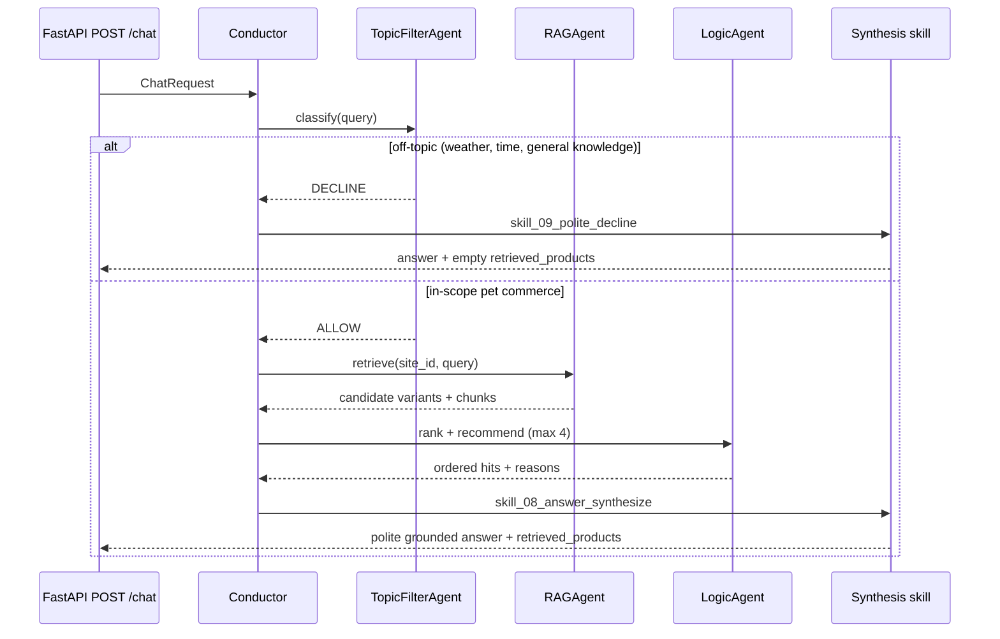
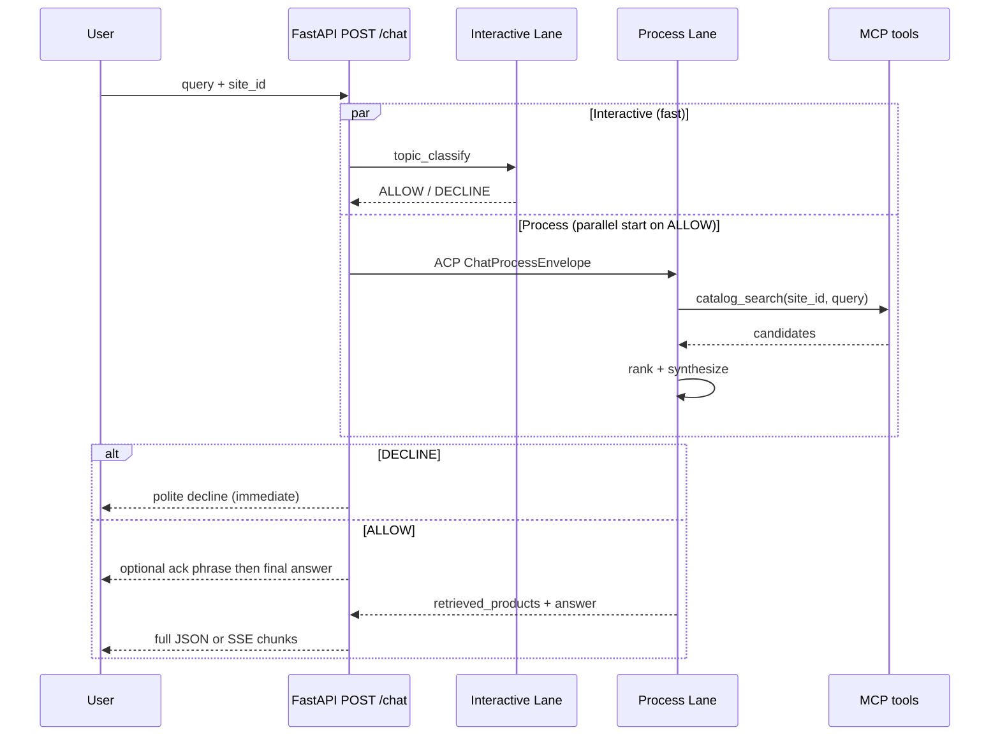

# zooplus Assistant — PoC Proposal (Agent-First)

**Status:** Final planning pass (Zeus synthesis, 2026-06-03)  
**Version:** 2.0 — adds **MCP + ACP**, **dual-lane latency**, **`.opencode/agents`**  
**Language:** English (all code, docs, prompts, README)  
**Primary spec:** `Coding Task.docx` + `product_catalog_dataset.json`  
**Goal:** A **traced PoC** measured against the original brief at every step, optimized as a **chat assistant** (user-perceived speed first).

---

## 1. Executive summary

Build **zooplus Assistant**: an **async FastAPI** service exposing `POST /chat` (and optional `POST /chat/stream`) that answers pet-product questions using **RAG-only** knowledge from the provided catalog, scoped by **`site_id`**.

**Architecture pillars:**

| Pillar | Design |
|--------|--------|
| **Chat speed** | **Dual-lane** execution: fast **Interactive Lane** (topic filter + conductor) vs **Process Lane** (RAG + logic + synthesis) running **in parallel** |
| **Agent-first** | OpenCode-style agents in `.opencode/agents/`; Python conductor enforces order |
| **MCP** | Catalog tools exposed **on the FastAPI host** as an MCP server (callable by OpenCode CLI and internal agents) |
| **ACP** | Typed **Agent Control Packets** for background dispatch (Guardian-inspired envelopes, PoC-local) |
| **Constraints** | Documented guardian-style policies — when to answer / decline |
| **Trace** | Every step documented under PoC `docs/trace/` vs brief |

This PoC prioritizes **visible engineering steps**, **latency to the user**, **quality gates vs. the brief**, and **polite, grounded** responses.

---

## 2. Alignment with the original brief (quality contract)

Every phase ends with a **Brief Alignment Check** (`docs/00-brief-alignment.md`):

| # | Requirement (Coding Task) | PoC acceptance signal |
|---|---------------------------|------------------------|
| 1 | Async Python **FastAPI** backend | `async def` routes; non-blocking I/O for LLM/embed calls |
| 2 | `POST /chat` `{ site_id, query }` | OpenAPI + integration tests |
| 3 | Response `{ answer, retrieved_products }` | Pydantic schema + golden JSON fixtures |
| 4 | **RAG only** from dataset | No LLM answers without retrieval context; empty retrieval → honest “no match” |
| 5 | **site_id** shop context | Hard filter on `site_id` before ranking (zero cross-shop leakage) |
| 6 | **Guardrails** — pet products only | Topic Filter Agent + documented decline templates |
| 7 | Production-oriented structure | Layered `src/`, typed config, extension points in README |
| 8 | Git repo + README | Architecture diagram, setup, trade-offs, roadmap |
| 9 | Evaluation: rigor, RAG reasoning, data use, trade-offs | `docs/` trace + `tests/` + optional RAGAS-lite checks |

---

## 3. Industry patterns applied (web research)

Patterns chosen **because they match this case** (catalog RAG + shop scope + recommendations), not generically:

| Pattern | Source / practice | Application here |
|---------|-------------------|------------------|
| **Filter-then-score retrieval** | [Fin.ai — Structured Agentic RAG](https://fin.ai/research/structured-agentic-rag-for-e-commerce/) | Apply `site_id`, `pet_type`, stock/price filters **before** vector ranking |
| **Multi-tenant metadata isolation** | [Actian multi-tenant RAG](https://www.actian.com/blog/developer/how-to-build-a-multi-tenant-rag-for-customer-support/), [multi-tenant-ecommerce-RAG](https://github.com/dhaneshvashisth/multi-tenant-ecommerce-rag) | `site_id` mandatory on every retrieval call |
| **Hybrid retrieval (optional PoC+)** | [gfg-rag-middleware](https://github.com/Architectshwet/gfg-rag-middleware) | Semantic + BM25 for SKU/brand exact match |
| **2–4 recommendations, clarifying questions** | [CE-008 conversational commerce](https://case-studies.ai/use-cases/customer-engagement/CE-008-conversational-commerce-shopping/implementation-guide/), [HelloRep guide](https://www.hellorep.ai/blog/personalizing-product-recommendations-with-conversational-ai-guide) | Conversation skill limits list size; asks pet type / diet constraints early |
| **Grounded answers only** | AWS Bedrock Agents ecommerce blog, CE-008 prompts | System prompt: never invent product names/prices |
| **Async FastAPI agent stack** | [The New Stack — production agents + RAG](https://thenewstack.io/how-to-build-production-ready-ai-agents-with-rag-and-fastapi/) | Timeouts, schema validation, traced steps |
| **Ingestion → embed → retrieve → generate** | [shopassist-rag](https://github.com/pranshu1921/shopassist-rag), [Conversational-E-Commerce-RAG-Agent](https://github.com/ui-dev-vivek/Conversational-E-Commerce-RAG-Agent) | Internal pipeline agent owns EDA + index build |

---

## 4. Repository layout (isolated PoC — no contamination)

New GitHub repository (e.g. `zooplus-assistant-poc`). **Do not** import or symlink `project_guardian` / workspace orchestration code. **Inspiration only** for constraint documentation style.

```
zooplus-assistant-poc/
├── .opencode/                    # OpenCode agent definitions (official layout)
│   ├── opencode.json             # MCP remote → local server; agent registry
│   └── agents/
│       ├── zooplus-conductor.md          # primary — fast user-facing orchestrator
│       ├── zooplus-topic-guard.md        # subagent — ALWAYS first; steps: 3; low temp
│       ├── zooplus-rag-worker.md         # subagent — Process Lane retrieval
│       ├── zooplus-logic-worker.md       # subagent — ranking / recommendations
│       ├── zooplus-rag-pipeline.md       # subagent — EDA + ingest (CLI/background)
│       └── zooplus-synthesis.md          # subagent — grounded answer generation
├── cli/                          # Operator CLI (Typer or Click)
│   ├── __main__.py
│   └── commands/
│       ├── eda.py                # Run EDA report from raw JSON
│       ├── ingest.py             # Build vector index (read-only raw)
│       ├── evaluate.py           # Golden queries vs brief
│       ├── chat_local.py         # Smoke-test without HTTP
│       └── acp_dispatch.py       # Fire ACP packet to Process Lane (debug)
├── src/
│   ├── api/                      # Async FastAPI app
│   │   ├── app.py
│   │   ├── routes/chat.py        # POST /chat (+ optional /chat/stream)
│   │   ├── routes/mcp.py         # MCP transport mounted on same server
│   │   └── dependencies.py
│   ├── lanes/                    # Dual-lane runtime (latency core)
│   │   ├── interactive.py        # Fast lane: topic + conductor facade
│   │   ├── process.py            # Slow lane: RAG + logic + synthesis
│   │   └── orchestrator.py       # asyncio.gather / TaskGroup coordinator
│   ├── acp/                      # Agent Control Packets (typed dispatch)
│   │   ├── envelopes.py          # ChatProcessEnvelope, TopicDeclineEnvelope
│   │   └── dispatcher.py         # Fire-and-forget + await with timeout
│   ├── mcp_server/               # MCP tool surface on FastAPI host
│   │   ├── server.py             # MCP SDK / streamable HTTP handler
│   │   └── tools/                # catalog_search, topic_check, constraints
│   ├── agents/                   # Python mirrors of .opencode agents
│   │   ├── conductor.py          # Interactive Lane entry
│   │   ├── topic_filter.py       # FAST — rules + small model
│   │   ├── rag_agent.py          # Process Lane
│   │   └── logic_agent.py        # Process Lane
│   ├── skills/                   # Enumerated, registered skills
│   │   ├── registry.py           # Skill catalog (id, version, agent owner)
│   │   ├── skill_01_topic_guard/
│   │   ├── skill_02_site_scope/
│   │   ├── skill_03_catalog_eda/
│   │   ├── skill_04_html_normalize/
│   │   ├── skill_05_embed_index/
│   │   ├── skill_06_hybrid_retrieve/
│   │   ├── skill_07_recommend_rank/
│   │   ├── skill_08_answer_synthesize/
│   │   └── skill_09_polite_decline/
│   ├── rag/
│   │   ├── pipeline.py           # Orchestrates ingest stages
│   │   ├── eda.py
│   │   ├── normalize.py          # HTML → text (non-destructive)
│   │   ├── chunking.py
│   │   └── store/                # Chroma (PoC) — swappable
│   ├── guardian/                 # Constraint layer (PoC-local)
│   │   ├── constraints.yaml      # Machine-readable rules
│   │   ├── policies.md           # Human-readable “when to answer / decline”
│   │   └── engine.py             # Evaluates topic + response policy
│   ├── models/                   # Pydantic: ChatRequest, ChatResponse, ProductHit
│   └── config.py
├── data/
│   └── raw/
│       └── product_catalog_dataset.json   # READ-ONLY copy; never mutated
├── artifacts/                    # Generated (gitignored): index, EDA HTML/MD
│   ├── eda/
│   └── index/
├── docs/                         # Traced PoC narrative (required)
│   ├── 00-brief-alignment.md
│   ├── 01-eda-report.md          # Generated + interpreted
│   ├── 02-rag-architecture.md
│   ├── 03-agent-flows-and-prompts.md
│   ├── 04-implementation-trace/  # Step-by-step log (date, decision, brief §)
│   └── constraints/
│       └── topic-boundary.md
├── tests/
│   ├── test_api_contract.py
│   ├── test_site_isolation.py
│   ├── test_topic_guard.py
│   └── fixtures/golden_queries.json
├── pyproject.toml
└── README.md
```

---

## 5. Async FastAPI API (mandatory)

```http
POST /chat
Content-Type: application/json

{
  "site_id": 3,
  "query": "What's the best dry food for a puppy with a sensitive stomach?"
}
```

```json
{
  "answer": "Based on products available in your shop, ...",
  "retrieved_products": [
    {
      "article_id": 3126505,
      "product_id": 968806,
      "variant_id": "968806.0",
      "product_name": "...",
      "variant_name": "...",
      "price": 9.3,
      "currency": "EUR",
      "pet_type": "DOGS",
      "brands": "...",
      "relevance_score": 0.87,
      "recommendation_reason": "high rating + matches dry food intent"
    }
  ]
}
```

**Implementation notes:**

- `src/api/routes/chat.py` — `async def chat(...)` only; use `asyncio.to_thread` or async HTTP client for sync embed/LLM SDKs.
- Request/response models in `src/models/` — strict validation.
- Health: `GET /health`.
- OpenAPI tags: `chat`, `system`.

---

## 6. Agent-first conductor (always Topic Filter first)



| Agent | Role | Skills used |
|-------|------|-------------|
| **Conductor** | Enforces order; no bypass of Topic Filter | registry only |
| **TopicFilterAgent** | Agentic classification: pet-product vs off-topic | `skill_01_topic_guard` |
| **RAGAgent** | Retrieval, context assembly | `skill_02_site_scope`, `skill_06_hybrid_retrieve` |
| **LogicAgent** | Business ranking (sales, rating, stock), recommendation cap | `skill_07_recommend_rank` |
| **Synthesis** | LLM answer from retrieved context only | `skill_08_answer_synthesize`, `skill_09_polite_decline` |

**Skill registry rules** (`src/skills/registry.py`):

- Each skill: `id`, `version`, `owner_agent`, `inputs`, `outputs`, `constraints_ref`.
- `SKILL.md` per folder (objective, preconditions, brief mapping).
- Agents load skills **only** via registry (no ad-hoc prompts in agent files).

---

## 7. Guardian-inspired constraint layer (standalone)

**Not** importing `project_guardian`. Replicate the **idea**: constraints are **data-driven, documented, and enforced before generation**.

`src/guardian/constraints.yaml` (example):

```yaml
assistant_id: zooplus_assistant
allowed_intents:
  - product_search
  - product_comparison
  - nutrition_ingredients
  - feeding_guidance
  - recommendation_by_pet_type
decline_intents:
  - weather
  - datetime
  - general_knowledge
  - competitors
  - non_pet_products
response_policy:
  tone: polite
  max_recommendations: 4
  must_ground_in_retrieval: true
  empty_retrieval_message: "I couldn't find matching products in this shop. Could you rephrase or specify dog/cat and product type?"
```

`docs/constraints/topic-boundary.md` — human-readable examples:

- ✅ “Dry food for puppy sensitive stomach” → ALLOW  
- ❌ “What time is it?” → DECLINE (polite)  
- ❌ “Best pizza in Berlin” → DECLINE  

Topic Filter uses **LLM classification + rule fallback** (keyword blocklist for weather/time).

---

## 8. RAG pipeline + EDA (internal agent / CLI)

**Principle:** Raw JSON is **immutable** (`data/raw/`). All transforms write to `artifacts/`.

### Phase A — EDA (`cli eda` → `docs/01-eda-report.md`)

| Analysis | Purpose |
|----------|---------|
| Record counts by `site_id`, `locale`, `pet_type` | Validates multi-shop filtering |
| Field completeness (`ingredients`, `feeding_recommendations`) | Routes nutrition queries |
| HTML density in `description` | Drives normalize skill |
| Price / revenue outliers | Document anomalies (do not silently fix source) |
| Top brands / categories | Informs eval queries |

### Phase B — Normalize (non-destructive)

- `skill_04_html_normalize`: strip tags → plain text fields alongside metadata.
- Preserve `article_id`, `site_id`, numeric fields for filters.

### Phase C — Index

- Chunk: one embedding doc per **variant** (or product family — document choice in `02-rag-architecture.md`).
- Metadata: `site_id`, `pet_type`, `article_id`, `price`, `stock_units`, `locale`.
- Store: **Chroma** local persistence under `artifacts/index/` (PoC simplicity).

### Phase D — Retrieve (filter-then-score)

1. **Hard filter:** `site_id == request.site_id` (mandatory).  
2. **Soft filters:** inferred `pet_type`, price band, in-stock preference.  
3. **Vector search** on normalized text (summary + description + ingredients).  
4. **Optional:** BM25 for brand/SKU keywords.  
5. Return top-K (K=10) → Logic Agent → **max 4** recommendations.

**RAG Agent** owns running the pipeline; **CLI** triggers rebuild for traced steps.

---

## 9. Conversation flows & prompts (English)

Documented in `docs/03-agent-flows-and-prompts.md`.

### Flow A — Discovery (default)

1. Acknowledge query politely.  
2. If ambiguous: one clarifying question (pet type, food vs toy, dietary constraint).  
3. Retrieve + recommend **2–4** products with short rationale each.  
4. Offer one follow-up (“Would you like wet food options or a lower price range?”).

### Flow B — Nutrition / ingredients

1. Confirm food/supplement intent.  
2. Prefer variants with non-empty `ingredients` / `feeding_recommendations`.  
3. Answer from retrieved fields only; cite `article_id` in `retrieved_products`.

### Flow C — Off-topic decline

Template ( `skill_09_polite_decline` ):

> “I'm the zooplus Assistant and can help with pet products for your shop. I can't help with that topic, but I'd be happy to find food, treats, or accessories for your dog or cat.”

### System prompt anchors (from industry practice)

- Only recommend products present in `retrieved_products`.  
- Never invent price, brand, or stock.  
- Always respect `site_id` scope.  
- Polite, concise, English (locale-specific catalog text may remain DE/ES in citations).

---

## 10. PoC documentation trace (sumamente importante)

`docs/trace/` — one markdown per step (see PoC repo `review_clones/PoC chatbot zooplus/docs/trace/`):

| Step | Doc | Brief check |
|------|-----|-------------|
| T0 | `T0-repo-bootstrap.md` | Repo structure, README skeleton |
| T1 | `T1-eda-run.md` | Data understood vs JSON |
| T2 | `T2-rag-index.md` | RAG ingest reproducible |
| T3 | `T3-topic-guard.md` | Off-topic declined politely |
| T4 | `T4-api-contract.md` | POST /chat async + schema |
| T5 | `T5-e2e-golden-queries.md` | Golden set passes |
| T6 | `T6-readme-final.md` | Diagram, trade-offs, roadmap |

Each file template:

```markdown
## Step TX — <title>
- **Date:**
- **Brief sections satisfied:** §...
- **Decision:**
- **Alternatives rejected:**
- **Quality evidence:** (test output, sample response)
- **Next step:**
```

---

## 11. Phased delivery plan (trace-oriented)

| Phase | Focus | Output | Quality gate |
|-------|-------|--------|--------------|
| **P0** | Bootstrap repo + `cli/` + `src/` skeleton | GitHub repo, empty FastAPI | Layout matches §4 |
| **P1** | EDA + constraints docs | `01-eda-report.md`, `constraints.yaml` | Findings match 300-row dataset |
| **P2** | RAG pipeline (CLI ingest) | `artifacts/index/` | Retrieval returns site-scoped hits |
| **P3** | `.opencode/agents` + skills + MCP tools on server | Agents + `mcp_server/` | OpenCode docs compliance |
| **P4** | Dual-lane orchestrator + ACP dispatch | `lanes/` + `acp/` | p95 topic filter < 300ms |
| **P5** | Async `/chat` (+ optional stream) + tests | API green on golden queries | Matches Coding Task contract |
| **P6** | README + trace completion | Submission-ready repo | Eval criteria in brief |

**Parallelism:** P2 ingest ∥ P3 agent stubs; P4 wires lanes before P5 integration.

---

## 12. Technology choices (PoC-simple, brief-aligned)

| Component | Choice | Trade-off |
|-----------|--------|-----------|
| API | FastAPI + Uvicorn (async) | — |
| Validation | Pydantic v2 | — |
| Vector DB | Chroma (local) | Swap to Qdrant in production |
| Embeddings | `text-embedding-3-small` or local `nomic-embed-text` | Document in README |
| LLM | OpenAI-compatible or Ollama | No Anthropic required |
| CLI | Typer | Thin wrapper over `src/rag`, `src/guardian` |
| Tests | pytest + httpx AsyncClient | Contract + isolation |

---

## 13. README outline (GitHub)

1. Title + one-paragraph purpose  
2. Architecture diagram (Mermaid: API → Conductor → Agents → RAG)  
3. Quick start (`uv sync`, `cli ingest`, `uvicorn`)  
4. API example (`curl POST /chat`)  
5. **Decisions & trade-offs** (Chroma, filter-then-score, 4-cap recommendations)  
6. **Future roadmap** (3–5 steps: observability, RAGAS eval, Redis cache, hybrid search, K8s)  
7. Link to `docs/04-implementation-trace/`

---

## 14. Dataset facts (for EDA baseline)

| Metric | Value |
|--------|-------|
| Records | 300 variants |
| `site_id` | 1, 3, 15 |
| `locale` | de-DE, en-GB, es-ES |
| `pet_type` | 150 DOGS / 150 CATS |
| Unique products | 154 |

---

## 15. Latency-first dual-lane architecture (chat assistant)

A **chat assistant** must feel responsive. Heavy RAG must **not** block the first byte to the user.

### 15.1 Two lanes, one request

| Lane | Purpose | Target latency | Agents |
|------|---------|----------------|--------|
| **Interactive** | User-facing guard + conductor | **< 300 ms** to first decision | `zooplus-topic-guard` → `zooplus-conductor` |
| **Process** | Retrieval, ranking, synthesis | 1–5 s (async, parallel) | `zooplus-rag-worker` → `zooplus-logic-worker` → `zooplus-synthesis` |



### 15.2 Parallelism rules (`src/lanes/orchestrator.py`)

1. **On ALLOW:** spawn Process Lane with `asyncio.create_task` **immediately** after topic guard passes (do not wait for LLM synthesis).
2. **Speculative retrieval (optional PoC+):** start keyword/site-scoped prefetch while topic guard runs (cancel if DECLINE).
3. **Interactive conductor** may emit a **short polite ack** (“Let me check products in your shop…”) while Process Lane runs — only if using `/chat/stream`; single-shot `/chat` waits with `asyncio.wait` + timeout.
4. **Topic guard** uses **rules first** (weather/time regex) → **small/fast model** only if ambiguous (keeps p95 low).
5. **Never** run full RAG ingest in the request path — index is **prebuilt** via `cli ingest`.

### 15.3 API modes

| Endpoint | Behavior |
|----------|----------|
| `POST /chat` | Synchronous JSON; waits for Process Lane (max timeout e.g. 15s) |
| `POST /chat/stream` | **Recommended for demo:** SSE — immediate guard result + streamed `answer` tokens |

Both remain **async FastAPI** (`async def`).

---

## 16. MCP — tools on the server (callable)

Per [OpenCode MCP docs](https://opencode.ai/docs/mcp-servers/), register the PoC FastAPI host as a **remote MCP server** so OpenCode agents and internal Python agents share the same tool contracts.

### 16.1 MCP tools (deny-by-default catalog)

| Tool name | Lane | Description |
|-----------|------|-------------|
| `zooplus_topic_check` | Interactive | Classify query: `in_scope` / `off_topic` |
| `zooplus_catalog_search` | Process | Semantic + metadata filter (`site_id` required) |
| `zooplus_product_get` | Process | Fetch variant by `article_id` |
| `zooplus_constraints_get` | Interactive | Return active policy YAML summary |
| `zooplus_recommend_rank` | Process | Rank candidates (sales, rating, stock) |

Implementation: `src/mcp_server/server.py` mounted at `/mcp` (Streamable HTTP or SSE per MCP SDK).

### 16.2 `opencode.json` (project root)

```json
{
  "$schema": "https://opencode.ai/config.json",
  "mcp": {
    "zooplus_assistant": {
      "type": "remote",
      "url": "http://127.0.0.1:8080/mcp",
      "enabled": true,
      "timeout": 5000
    }
  },
  "tools": {
    "zooplus_*": false
  },
  "agent": {
    "zooplus-conductor": {
      "tools": { "zooplus_topic_check": true, "zooplus_constraints_get": true }
    },
    "zooplus-rag-worker": {
      "tools": { "zooplus_catalog_search": true, "zooplus_product_get": true }
    }
  }
}
```

Per-agent tool enablement follows [per-agent MCP pattern](https://opencode.ai/docs/mcp-servers/#per-agent).

---

## 17. ACP — Agent Control Packets (background dispatch)

**ACP** here follows the **Guardian PoC pattern** (`TribeLeaderIntakeEnvelope` / `DispatchEnvelope`): typed, bounded packets for **fire-and-forget or await** dispatch to Process Lane — **not** a dependency on `project_guardian`.

### 17.1 Envelope: `ChatProcessEnvelope`

```python
# src/acp/envelopes.py (conceptual)
@dataclass(frozen=True)
class ChatProcessEnvelope:
    dispatch_id: str
    session_id: str
    site_id: int
    query: str
    intent: Literal["product_search", "nutrition", "recommendation", "comparison"]
    source_surface: str          # "api/chat" | "cli/chat_local"
    target_lane: str             # "process"
    idempotency_key: str
    context_summary: str         # last N turns truncated
    payload: dict[str, Any]      # pet_type hint, locale, etc.
```

### 17.2 Envelope: `TopicDeclineEnvelope` (fast path)

Emitted by Interactive Lane when off-topic — **no Process Lane** spawn.

### 17.3 Dispatcher (`src/acp/dispatcher.py`)

- `dispatch_process(envelope) -> asyncio.Task` — Process Lane worker  
- `dispatch_timeout_seconds: 15` (aligned with Guardian dispatch budgets)  
- Receipt: `{ dispatch_id, dispatch_ok, status, blocked_reason? }`  
- Log every packet to `docs/04-implementation-trace/ACP-*.md` for PoC traceability  

### 17.4 CLI debug

`cli acp_dispatch --site-id 3 --query "..."` — sends envelope without HTTP for traced testing.

---

## 18. `.opencode/agents` — official instructions

Follow [OpenCode Agents documentation](https://opencode.ai/docs/agents/):

- Markdown agents in **`.opencode/agents/`** (project-local).  
- Frontmatter: `description`, `mode`, `model`, `temperature`, `steps`, `permission`.  
- **Subagents** for Process Lane; **primary** for conductor.  
- **Task permissions** so conductor may invoke only `zooplus-*` workers.  

### 18.1 Agent catalog

| File | mode | Model tier | steps | Role |
|------|------|------------|-------|------|
| `zooplus-conductor.md` | primary | fast (Haiku-class) | 5 | User-facing orchestration; `@` invoke workers |
| `zooplus-topic-guard.md` | subagent, **hidden** | fast | **3** | Mandatory first gate; `temperature: 0` |
| `zooplus-rag-worker.md` | subagent | mid | 8 | MCP `catalog_search` only |
| `zooplus-logic-worker.md` | subagent | mid | 5 | Rank + cap 4 recommendations |
| `zooplus-rag-pipeline.md` | subagent | mid | 15 | EDA + ingest (offline; no `/chat` path) |
| `zooplus-synthesis.md` | subagent | strong | 6 | Grounded answer; polite tone |

### 18.2 Example: `zooplus-topic-guard.md` (excerpt)

```markdown
---
description: Fast in-scope classifier for zooplus Assistant. ALWAYS runs before any catalog or LLM work.
mode: subagent
hidden: true
temperature: 0.1
steps: 3
model: opencode-go/qwen3.6-plus
permission:
  edit: deny
  bash: deny
  zooplus_catalog_search: deny
  zooplus_topic_check: allow
---

You are the topic guard for zooplus Assistant.

ALLOW: pet food, treats, toys, accessories, nutrition, feeding, product search in catalog.
DECLINE politely: weather, time, news, non-pet products, general knowledge.

Output JSON only: {"decision":"ALLOW"|"DECLINE","reason_code":"...","polite_decline":null|"..."}
```

### 18.3 Conductor Task permissions (`opencode.json`)

```json
"zooplus-conductor": {
  "mode": "primary",
  "permission": {
    "task": {
      "*": "deny",
      "zooplus-topic-guard": "allow",
      "zooplus-rag-worker": "allow",
      "zooplus-logic-worker": "allow",
      "zooplus-synthesis": "allow"
    }
  }
}
```

See [Task permissions](https://opencode.ai/docs/agents/#task-permissions).

### 18.4 Python ↔ OpenCode alignment

| OpenCode agent | Python module | Lane |
|----------------|---------------|------|
| `zooplus-topic-guard` | `src/agents/topic_filter.py` | Interactive |
| `zooplus-conductor` | `src/agents/conductor.py` | Interactive |
| `zooplus-rag-worker` | `src/agents/rag_agent.py` | Process |
| `zooplus-logic-worker` | `src/agents/logic_agent.py` | Process |
| `zooplus-synthesis` | `src/skills/skill_08_answer_synthesize/` | Process |

Prompts in `.opencode/agents/*.md` are **source of truth**; Python loads mirrored prompts from `src/agents/prompts/`.

---

## 19. Updated quality gates (v2)

| Gate | Metric | Brief § |
|------|--------|---------|
| G1 | Topic guard p95 < 300ms | Guardrails |
| G2 | Zero cross-`site_id` retrieval | Multi-shop |
| G3 | MCP tools callable from OpenCode | Trace / integrability |
| G4 | ACP receipt logged per `/chat` | PoC trace |
| G5 | Answer only cites `retrieved_products` | RAG |
| G6 | Off-topic → polite decline, empty products | Guardrails |

---

## 20. Zeus final synthesis

| Input | Outcome |
|-------|---------|
| User feedback (MCP, ACP, speed, dual lane) | §15–17 |
| OpenCode official docs | §18 + `.opencode/` in §4 |
| Guardian ACP pattern (read-only inspiration) | §17 envelopes |
| Coding Task.docx | §2 unchanged contract |
| Bridges (Prometheus/Hera/Hermes) | Prior phases; Oracle bridge rate-limited — Zeus completed v2 inline |

**Next action:** Bootstrap repo **P0** with `.opencode/agents/` + empty `src/lanes/` + `src/mcp_server/` + `src/acp/`, then **P1 EDA trace**.

---

## References

### Brief & patterns
- [Structured Agentic RAG for Ecommerce (Fin.ai)](https://fin.ai/research/structured-agentic-rag-for-e-commerce/)
- [How to build production-ready AI agents with RAG and FastAPI (The New Stack)](https://thenewstack.io/how-to-build-production-ready-ai-agents-with-rag-and-fastapi/)
- [CE-008 Conversational Commerce Implementation Guide](https://case-studies.ai/use-cases/customer-engagement/CE-008-conversational-commerce-shopping/implementation-guide/)
- [multi-tenant-ecommerce-RAG (GitHub)](https://github.com/dhaneshvashisth/multi-tenant-ecommerce-rag)
- [shopassist-rag (GitHub)](https://github.com/pranshu1921/shopassist-rag)

### OpenCode (official — agent + MCP instructions)
- [Agents](https://opencode.ai/docs/agents/) — `.opencode/agents/`, modes, permissions, Task, `steps`, temperature
- [MCP servers](https://opencode.ai/docs/mcp-servers/) — local/remote MCP, per-agent tool gating

### Workspace inspiration (not imported)
- `.opencode/agents/guardian-ghost-team-etl.md` — permission + MCP router pattern
- `project_guardian` `TribeLeaderIntakeEnvelope` — ACP envelope shape
